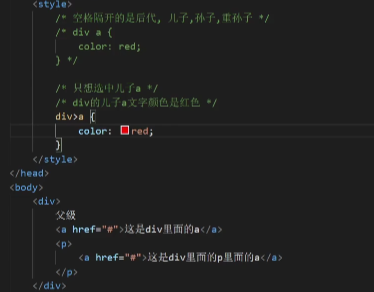
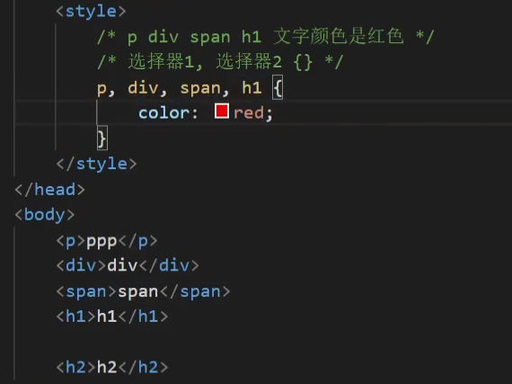
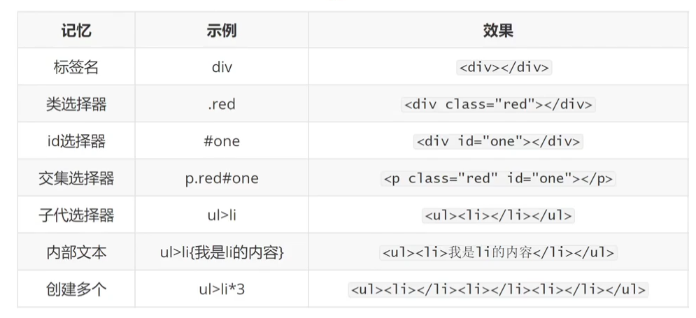

<h1>进阶选择器</h1>
#1.后代选择器(空格号隔开依序写)
 1)父元素里所有相同后代标签被选中;

 1)选中的是父元素里最近的儿子级别标签
#3.并集选择器(,逗号隔开)

 1)选择标签都被选中;
#4.交集选择器(标签连着写)
例如:div.container{ 属性 }--表示只选中类标签为container的div标签;
#5.伪类选择器(:hover{ 属性 })
 1)鼠标悬停某个标签时发生的属性变化;
例子: div:hover{
    color:red;
}---当鼠标悬停在div标签时,div文字颜色变为red;
#6.Emmet快速生成语法

<h1>background背景</h1>
#1.background-image背景图片(类似背景颜色)
例子:background-image:url(图片路径);
1.特点:
 1)url(图片路径);
 2)不能撑大盒子,默认平铺盒子;
2.属性值:
 1)repeat平铺--默认值;
 2)no-repeat不平铺;
 3)repeat-x延x轴平铺;
 4)repeat-y延y轴;
#2.background-position背景位置
例子:background-position: 水平位置 垂直位置;
1.属性值:
 1)水平方向:left,center,right;
 2)垂直方向:top,center,bottom;
2.二属性值:
 *数字px(以左上角为坐标原点)*--正值向右和下,负值向左和上;
3.水平垂直居中:
background-position:center;
#1.background-size背景图片尺寸
例子:background-size:宽度 高度;
 1.属性值:
  1)contain
  2)cover--等比例放大直达暂满整个盒子;
  3)数字px
  4)%
#4.background复合写法(属性值可乱序)
例:background:各属性的属性值 position值/size值;
注意:background-size一般单独写

