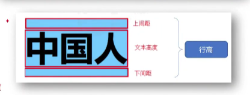

#1.font字体样式
##1.fong-weight文字粗细属性
1.属性值100-900;
2.属性值
 1)lighter(200);
font-weight:lighter--文字变细
 2)normal(400)默认的;
 3)bloder(700);
##2.font-style字体样式
1.属性值:
 1)normal
 2)italic倾斜
##3.font-size文字大小
例子:  font-size: 数字px;
##4.font-family字体类型
windows默认字体微软雅黑
1.sans-serif无衬线字体--文字粗细均匀
2.衬线字体--有笔锋
3.等宽字体--字体宽度相同
##5.字体复合属性
{font: style值 weight值/ line-height值 size值 family值}
 1)只可以省略前2个
例子:{font: 28px 微软雅黑}
##6.层叠问题(<i>就近原则</i> )
一个标签设置相同属性,最下面属性被浏览器渲染生效
#2.text文本属性
##1.text-indent首行缩进
1.属性值--数字px;
2.属性值--数字em(em代表1个字体单位);
##2.text-align文本<u>水平</u>对齐方式
1.属性值:left默认,center,right;
2.特点:
 1)适用对象:文本,span和a,img和input;
 2)属性设置在父级标签上
##3.text-decoration文本修饰
1.属性值:
 1)overline上划线;
 2)line-through删除线;
 3)underline下划线;
 4)none;
例:<a style="text-decoration:none;">取消超链接下划线</a>
##4.line-height行高

写法:{font:style weight size/line-height family}
1.应用:设置在父元素上且=父元素height,能让父元素里文字垂直方向对齐;
2.属性值:
 1)数字px
 2)数字--表示是字体size的倍数
