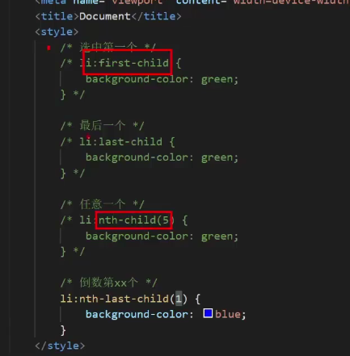

#1.结构伪类标签
1.选择具体标签

2.公式选择器 

#2.伪元素::before和::after(默认行内元素)
例子: 
  div::before{
    contend:"内容必须有";
}
 1.特点:
  1)通过css创建标签;
  2)在父元素里创建子标签(默认行内元素);
#3.标准流(标签默认排列方式)

<h1 align="center">float浮动</h1>
#1. 图片环绕和网页布局的板块排列
例子: float:left,right;
 1)特点:
  (1)半脱标状态,原位置空出来不占有,不覆盖次标签内容;
  (2)可设置宽高,一行排列;
  (3)元素不能设置水平居中"margin: 0 auto;"
#2.clear清除浮动方法
  1.父级元素设置高度固定;
  2.额外标签法--clear:both;
父元素最后添加空的块级元素设置div{ clear:both };
  3. ::after单伪元素清除浮动
  4.::before,::after双伪元素清除法
  5.overflow:hidden在父元素上设置
#3.css属性书写顺序(浏览器
执行效率高)

float浮动>box-sizing盒子模型(margin>border>padding>宽高>背景)>font文字属性;
#3.

