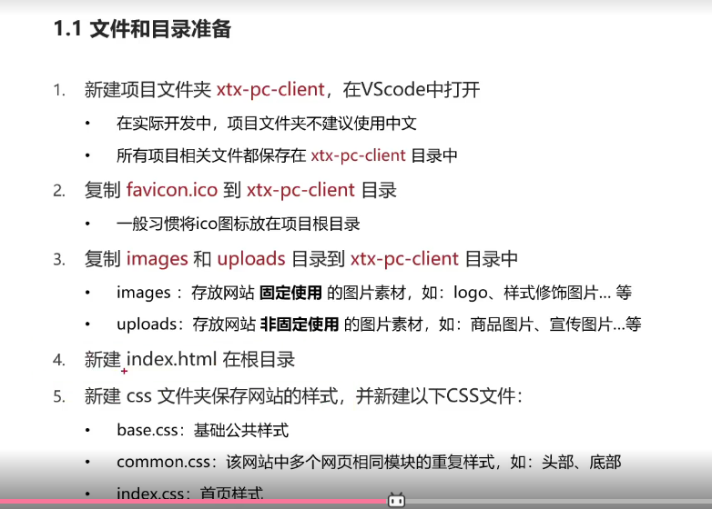
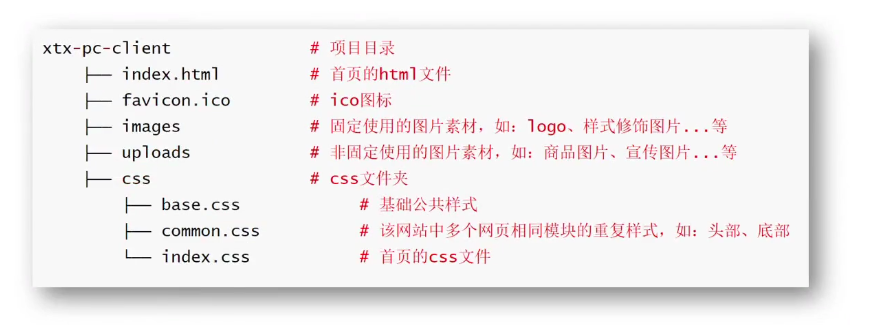

<h1>position定位</h1>
#1.定位使用
##1.属性值:static,relative,absolute,fixed;
##2.设置偏移值
1.水平属性名:left(先考虑),right;
2.垂直属性名:top(先),bottom;
#2.relative相对定位(半脱标)
1.特点:
 1)相对自己原位置偏移;
 2)原空位置仍占位;
 3)不改变元素特性
#3.absolute绝对定位(子绝父相-脱标)
1.特点:
 1)父级有定位,以父级为参照物偏移;父级无定位以浏览器窗口为参照物偏移;
 2)脱标不占位;
 3)改变元素显示模式特点--变成行内块(需要自加宽高);  
 4)不能使用(margin: 0 auto)水平居中 
#4.fixed固定定位
 1.特点:
  1)脱标--不占位置;
  2)相对浏览器窗口偏移;
  3)具备行内块特点--设置宽高;
#5.定位的层级问题(就近原则)
1.(z-index:数字;)提升层级顺序--必须配合定位;

<h1 align="center">装饰</h1>
#1.vertical-align垂直对齐方式
注意:*浏览器默认把行内元素和行内块元素当文字处理*.
 1)baseline默认基线对齐
 2)top
 3)middle
 4)bottom
#2.cursor光标效果
 1)属性值:
  1.default默认的箭头;
  2.pointer小手效果--提示点击;
  3.text工字型--提示用户选择文字;
  4.move十字光标--用户可以移动;
#3.border-radius边框圆角

 1)属性值:
  1.数字px;(方位顺序:顺时针)
  2.%--盒子自己的%;
#4.overflow文字溢出部分处理
 1.visible默认的显示;
 2.hidden溢出隐藏
 3.scroll溢出部分显示滚动条
 4.auto根据内容是否显示滚动条;
#5.(display:none)元素隐藏
 1.visibility:hidden;
占位隐藏效果
 2.display:none;
不占位隐藏效果--隐藏的部分不占位置;
#6.opacity元素整体透明效果
 1.属性值:0-1;(0完全透明)
#7.linear-gradient线性渐变
例子:linear-gradient: transparent rgba(0 , 0 ,0,.8);

#1.精灵图
 1)作用:
 减少服务期发送次数,提升页面加载速度;
 2)使用:
  1.创建盒子-等宽高于小图;
  2.作为背景图使用;
  3.background-position调节到小图具体位置(取值为负值);
#2.box-shadow盒子阴影

#3.transition过渡
例子:transition:all time;

<h1 align="center">网页项目前置</h1>网页
#1.网页骨架结构

#2.SEO优化

##1.SEO优化三大标签

1.title网页标题
2.description网页描述
3.keywords网页关键词
#3.favicon网页标题图标
<!-- rel定义文件与html关系 -->
例子:<link rel="" href="图标路径" type="图标类型">

<h1 align="center">项目搭建准备</h1>

