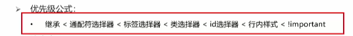
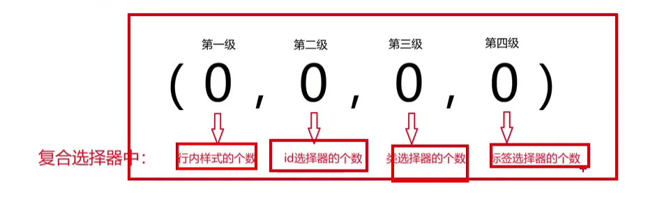
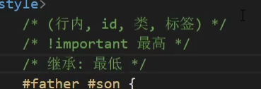
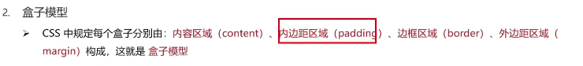

#1.css优先级

#2.权重叠加

#3.盒子模型
 
##1.contend内容区域
 1)width和height设置其大小;
##2.padding内边距
 1)会增大盒子;
 2)属性值:
       padding:上 右 下 左;
       padding:上下 左右;
       padding:上 左右 下;
##3.border边框
例子: border:1px solid red; 
 1)快捷键: bd + Tab键;
 2)具体方向使用: border-方向; 
 3)会增大盒子;
##4.margin外边距
写法类似padding
##5.box-sizing: border-box自动内减
 1)不需要计算减去border和padding;
 2)盒子大小等于宽高;
##6.清除默认内外边距
*{
    margin: 0;
    padding: 0;
}
##6.外边距塌陷问题(坑爹现象)
解决办法:
 1)设置父元素的border或padding;
 2)设置父元素overflow:hidden;
 3)设置子元素display:inline-block;
##7.inline行内元素的内外边距
 1)只有左右设置生效;