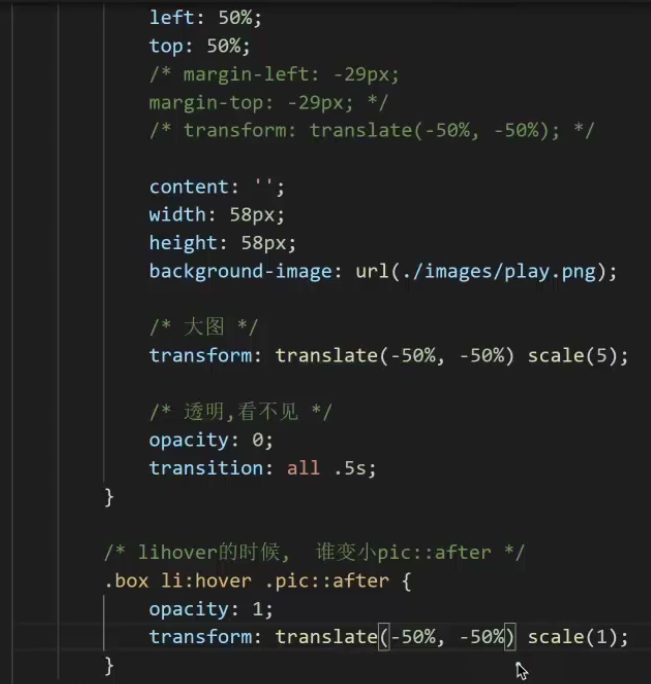
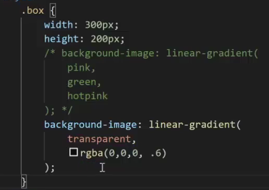

##1.iconfont字体图标

网址--http://www.iconfont.cn
#2.transform平面转换--位移,旋转,缩放
##1.translate位移
例子:transform:translate(水平,垂直);
    1.数字px;
    2.%--参照物为自身宽高;
1.属性值:
 translateX()或者translateY()

## ##2.rotate旋转

注意:默认围绕元素中心旋转
rotate(角度deg)
##3.scale缩放
scale(数字)
##4.transform-origin转换中心点
##5.transform复合写法
transform: translate(水平,垂直 ) scale(倍数数字);
##6.盒子居中对齐
例子:
.box{
    position:absolute;
    top:50%;
    left:50%;
    <!-- 默认%水平位移的参照物是盒子本身宽高 -->
    或者transform:translate(-50%,-50%); 
    <!--2.margin-top:-一般盒子高;
          margin-left:盒子一半宽度;
     -->
}
##7.层叠问题
注意:后面的transform属性值会覆盖前面的值,建议复合属性写法!

<h1>渐变背景</h1>
background-image: linear-gradient(颜色1, 颜色2)

例子:
.box{
    background-image: linear-gradient(
    transparent,
    rgba()
)
}