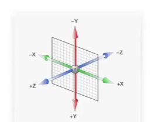

#空间转换"3D转换"

##1.translate3D(x,y,z)空间平移
 1.Z轴方向变化需要配合透视效果才能看得出--近大远小;
 2.perspective透视效果(加在父元素上);
例子:.box{ perspective: 800px;}
   ==1)属性值--一般(800-1200px);==
##2.rotate旋转
 1.rotateX/Y/Z
 2.perspective透视效果(加在父元素上)--看起来效果明显"透视效果";
 3.旋转方向判断--<b>"左手法则"</b>
*左手法则:左手握住旋转轴,大拇指指向正轴方向,四指弯曲方向指向的是正值*
<i><b>注意</b>:Z轴方向是我们视线看的方向,旋转会<u>导致Z轴改变</u></i>
##3.transform-style:preserve-3d--属性增强预览3D效果
<b>注意:</b>谁使用3D效果,此属性加在谁父元素上;
##4.综合例子
第一步---ul{
    <!-- 谁使用3D效果,此属性加在谁父元素上 -->
    transform-style:preserve-3d;
}
第二步--li{
    transform:rotateX(数字deg);
    <!-- 效果过渡时间;谁使用过渡效果谁添加此属性 -->
    transition:all 数字s;
}
第三步--li:hover{
    transform:rotateY(数字deg);
}