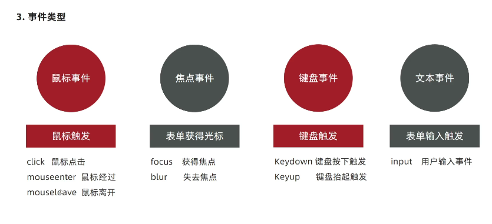
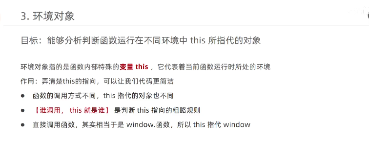

##  1.事件

### 定义:

编程时系统内发生的动作或事情,比如网页单击按钮

## 2.事件监听:

### 1.定义:

检测是否有事件产生,一旦有事件触发,即调用函数做出响应--也称注册事件

### 2.语法:

~~~js
元素.addEventListener('事件',要执行函数)
~~~

### 3.事件监听三要素:

-  1)事件源:dom元素被事件触发了,要获取元素(谁要做事)

-  2)事件:什么方式触发,比如单击click,鼠标经过mouseover(做的事)

-  3)事件调用函数:触发后做的事情(做的什么事)


### 4.事件监听版本


### 5.事件类型




-  鼠标事件

  click,mouseenter,mouseleave

- 焦点事件

  focus,blur失去焦点

- 键盘事件

  keydown键盘按下触发

- 文本事件

  input用户输入

## 1.函数高级用法:

### 1.函数表达式:

```js
function(){
    
}
```


### 2.回调函数:

函数作为参数传递

```js
function fn(){
}
setInterval(fn,1000)//先执行,再调用fn,fn就是回调函数
```


## 2.环境对象--this



## 3.编程思想

### 1).排他思想(双重循环)

利用for循环--干掉所有人,复活自己

```js
for (let j=0;j<arr.length;j++){
    arr.classList.remove('追加属性')
}
arr[i].classList.add('追加属性')
```

