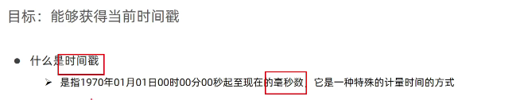

# 1.Node节点操作

## 1.定义:

DOM树中所有内容都是节点

比如:*元素节点div等,属性节点src等,文本节点....

## 2.查找节点

父节点,子节点,兄弟节点

###  1)查找父节点parentNode

###  2)查找子节点

children/childNodes

~~~js
1.子元素.parentNode.属性//查找父元素节点
2.父元素.children//仅获得元素节点,返回的是伪数组
  父元素.childNodes//获得所有子节点,包括文本,注释等,返回的是伪数组
~~~

*注意:  ul.children获得的是伪数组*

~~~js
console.log(ul.children)//打印输出所有子元素li
~~~

###  3)查找兄弟节点

  1.下一个兄弟节点--nextElementSibling属性

  2.上一个兄弟节点--previousElementSibling属性

## 3.增节点

### 1.创建节点(先)

document.createElement('标签')

### 2.追加节点(后)

 1.父元素.appendChild(要插入的元素)--插入到父元素后面

  1)要想创建的元素在界面看到,还需要追加到父级元素中

~~~js
//创建节点li
let li =document.createElement('li')
//追加节点到父元素中的前面
ul.appendChild(li)//输出ul就有追加的li

~~~

 2.父元素.insertBefore(子元素,放到哪个元素前面)

### 3.克隆节点

元素.cloneNode(布尔值)

~~~js
//默认false
1.true时,克隆时包含后代节点一起克隆
2.false时,克隆时不包含后代节点
~~~

## 4.删除节点--通过父元素删除

父元素.removeChild(要删除的元素),从html中删除

# 2.Date时间对象

## 1.定义:

用来表示时间的对象,可以的到系统当前时间

## 2.new实例化:

new关键字,操作成为实例化

~~~js
//1.获得当前时间
let date =new Date()
//2.获得指定时间
let time=new Date('1995-06-07')
//3.其他数据
  //1)创建数组
let arr = new Array()//创建数组未简化写法
let arr = []
  //2)创建对象
let obj= new Object()
let obj={}
~~~

## 3.时间对象方法

## 4.时间戳

计算总毫秒数

 1)getTime()

~~~js
//得倒当前时间date
let date = new Date()
//1.getTime()得倒时间戳
console.log(date.getTime())
//2.简写版: +new Date()
console.log(+new Date())
//3.Date.now()
console.log(Date.now())

~~~

 **2)+new Date()**

 3)Date.now()

 无需实例化,**只能获取当前时间戳**,前面两种能获取指定时间戳