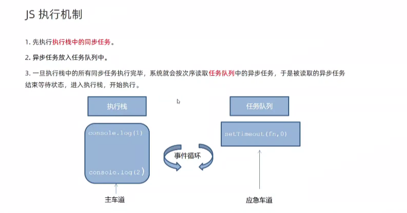
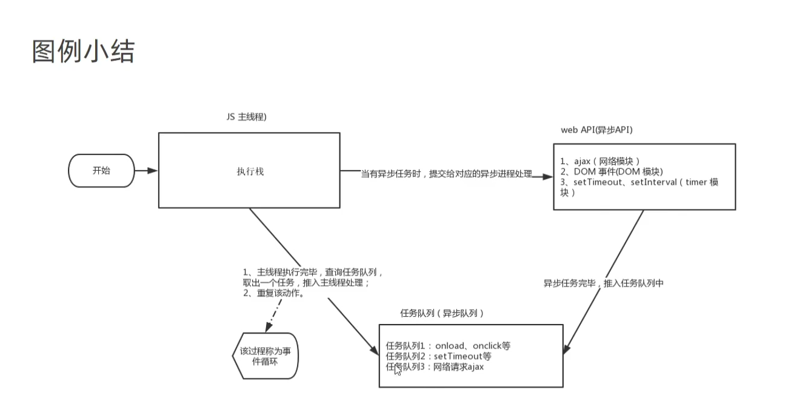

# window对象

## 1.BOM浏览器对象模型

1)window是浏览器内置中的全局对象,所学web APIS内容都是基于window对象实现的

2)包含属性:

navigator,location,document,history,screen

3)基于window的属性,window可以省略

## 2.setTImeOut定时器--延时函数

让代码延迟执行,仅执行一次,省略window

~~~js
//开启定时器
setTImeOut(回调函数,等待毫秒数)
//关闭定时器
clearTimeOut(函数名)
~~~

## 3.递归函数

~~~js
function fn(){
  fn()
}
fn()
~~~

## **4.<u>JS执行机制</u>**

###  1)同步和异步

#### (1)同步任务

都在主线程上执行,形成执行线

~~~js
//举例子
let num =0
~~~

#### (2)异步任务(回调函数)

JS异步通过回调函数实现的

~~~js
//包括:函数,事件等
~~~

### 2)执行机制

先执行执行栈中的同步任务,再执行异步任务的队列任务

### 3)事件循环event loop

主线程不断获得任务,再执行任务(不断重复)

## 5.location对象

拆分并保存URL地址的各组成部分

####  1)常用属性和方法

#####  (1)href跳转地址

~~~js
//通过js方式跳转到目标地址
location.href='url地址'
~~~

##### (2)search获得?后面值

##### (3)hash获得#后面部分(哈希值)

~~~js
console.log(location.hash)
~~~

##### (4)reload方法

用来刷新当前页面,传入参数true表示强制刷新

~~~js
location.reload()//正常刷新页面
//强制刷新页面,相当于ctrl+f5
location.reload(true)//刷新方法,有本地缓存
~~~

## 6.navigator对象

记录了浏览器自身相关信息,获取浏览器信息

### 1)常用属性和方法

userAgent

## 7.history对象

### 1)常用属性和方法

## 8.localStorage本地存储

### 1.存储数据setItem

~~~js
//存储内容,存在浏览器中
localStorage.setItem(key,value)
//例子
localStorage.setItem('uname','鹏举')
~~~

### 2.获取数据getItem

~~~js
localStorage.getItem(key)
~~~

### 3.删除数据removeItem

~~~js
local.Storage.removeItem(key)
~~~

### 4.存储复杂数据类型--**JSON转化**

~~~js
//1.复杂数据转换为JSON字符串
JSON.stringify(数据)
//2.JSON字符串转化为对象
JSON.parse(JSON字符串)
~~~

# 拓展:<u>自定义属性setAttibute</u>

## 1.固有属性

标签天生自带的属性,比如class,id,title,直接使用点语法操作

## 2.自定义属性setAttibute

~~~js
//1.设置自定义属性
setAttibute('属性名','属性值')
//2.获取自定义属性
getAttibute('属性名')
//3.删除自定义属性
removeAttibute('属性名')
~~~

## 3.<u>自定义属性规范(data-自定义属性)</u>

