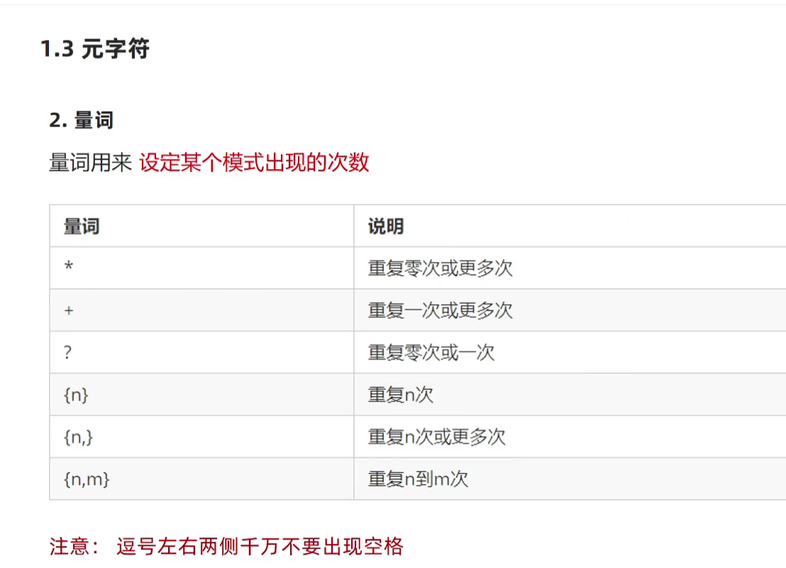
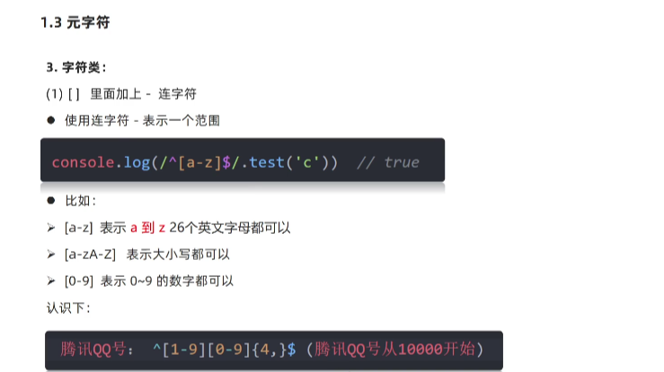
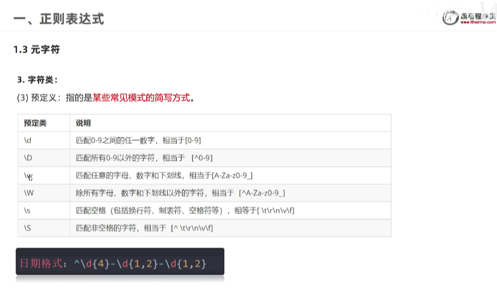

# 正则表达式

## 1.定义

 正则表达式（Regular Expression）是用于匹配字符串中字符组合的模式。在 JavaScript中，正则表达式也是对象

## 2.作用

~~~js
1.表单验证
2.过滤敏感词汇
3.替换特定部分
~~~

## 3.语法

### 1)定义规则:/表达式/

~~~js
// / /是正则表达式字面量
let 变量名 =/表达式/
//举例子
let obj =/激情/
~~~

### 2)检测查找是否匹配

#### (1)判断是否有匹配:test()

返回值是Boolean值

~~~js
regObj.test(被检测的字符串)
//举例子
let str ='1,2,3,45,56,'
let reg=/3/
let re=reg.test(str)//检测str是否匹配re
console.log(re)//输出true
~~~

#### (2)检测符合规则的字符串:exec()

获得的是数组arr,否则是null

.png)

## 4.元字符

### 1.边界符(^和$)

~~~js
// ^开头
console.log(/^abc/.test('abc'))//检测内容是否以abc为开头
// $结尾
~~~

### 2.量词-重复次数

~~~js
// * 被检测数据匹配次数>=0
console.log(/a*/.test(''))//true
~~~

###  3.字符类

 1)连字符[-]

~~~js
[a-z]表示匹配字母a到z
~~~

## 5.修饰符

约束正则执行的细节行为

~~~js
/表达式/修饰符
~~~

###  1)replace替换     

~~~js
字符串.replace(/表达式/,'替换的文本')
~~~

