# 1.函数定义和使用方式

## 1.函数定义方式

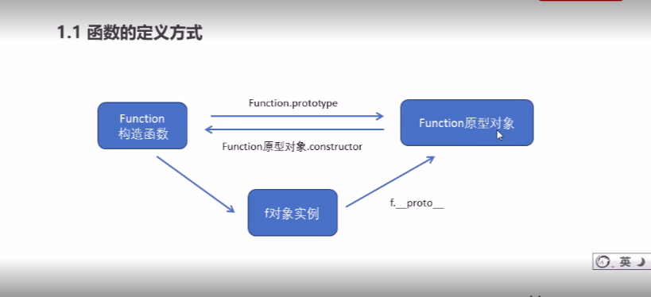

~~~js
//所有函数都是通过Function的实例对象
let fn = new Function('参数1','函数体')
fn()
~~~

## 2.函数调用方式

- 普通函数

  ~~~js
  function fn(){
      
  }
  //调用执行
  fn()
  //或者fn.call(要调用的函数,参数)
  ~~~

- 构造函数

  ~~~js
  function Star(){
  //函数体
  }
  new Star()
  ~~~

- 对象方法

  ~~~js
  let obj ={
    name:'中国',
    age:25,
    sing:function(){
  console.log('唱歌')
    }
  }
  obj.sing()
  ~~~

- 绑定事件

- 定时器

  ~~~js
  setInterval(function(){},间隔时间)
  ~~~

- 立即执行函数

  ~~~js
  (function(){}())
  //或者
  (function(){})()
  ~~~

# 2.this指向

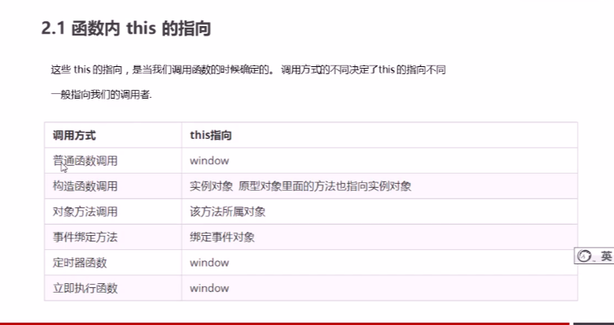

## 1.改变函数内部this指向

### (1)call()调用函数,改变this指向;可以实现继承

~~~js
let obj = {
  address:'Chinese',
  age:18
}
function fn(){
console.log(this)
}
//fn中this指向obj
fn.call(obj)
~~~

### (2)apply()调用函数,参数以数组形式传递

~~~js
//参数以数组形式传递
fn.apply(thisArg,[argsArray])

~~~

### (3)bind()不能调用原函数,改变this 指向成为新函数

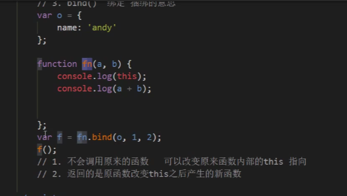

### (4)总结

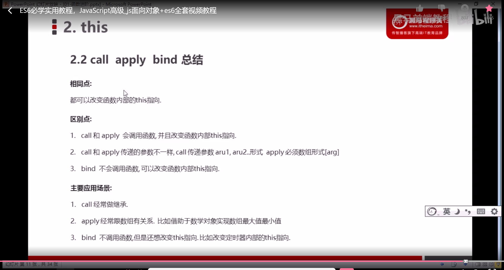

# 3.严格模式'use strict'

## 1.脚本开启严格模式

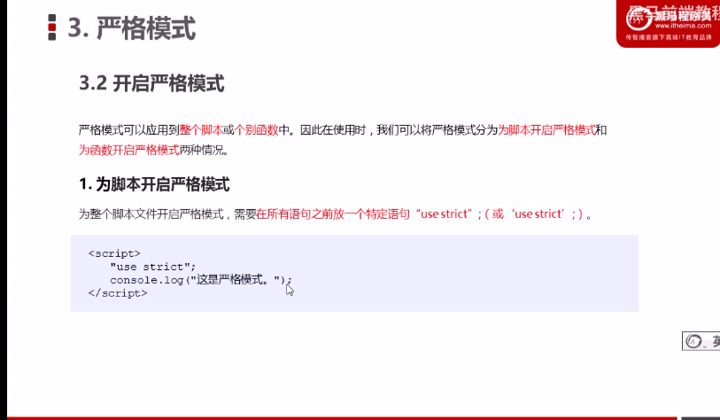

## 2.函数开启严格模式

~~~js
function fn(){
    //函数添加严格模式,写在函数内部
    'use strict'
}
~~~

## 3.严格模式的变化

- 变量必须先声明再使用

- 不能随意删除已经声明的变量

- this指向问题

  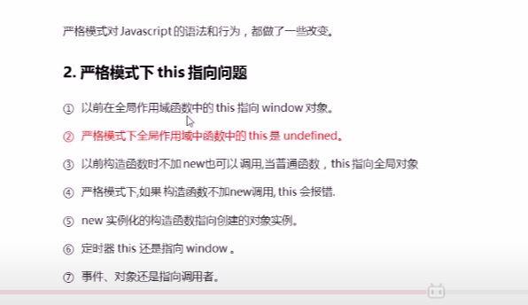

- 全局作用域下this是undefined

  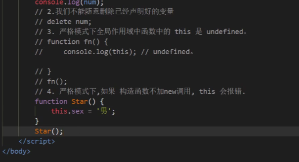

- 函数参数问题

  1. 函数参数不允许重名

  2. 不允许在非函数内部声明函数

     ~~~js
     'use strict'
     if(true){
         //严格模式下,函数写在非函数内部会报错
         function fn(){
       }
         fn()
     }
     ~~~

# 4.高阶函数

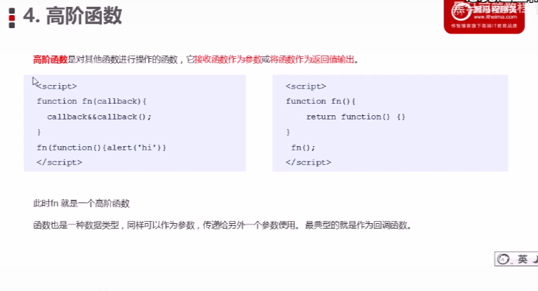

对接受的函数进行操作的函数叫做 **高阶函数**

# 5.closure闭包

[闭包](https://www.runoob.com/w3cnote/closure-intro.html)

~~~js
//一个函数访问了另一个函数的局部变量就是这个函数就产生了闭包
~~~

## 1.变量作用域

- 全局变量(外部的)

  函数内部可使用全局变量

- 局部变量(内部的)

  函数外部不可使用内部变量

- 函数执行完毕,本作用域的局部变量销毁

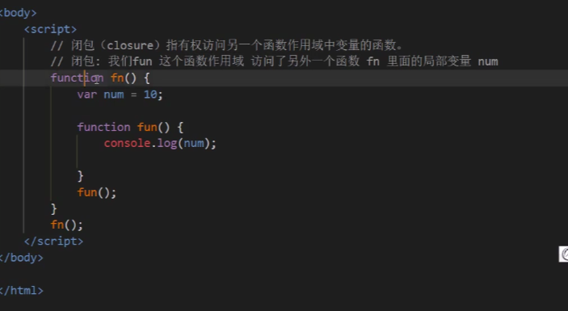

## 2.闭包作用

延伸了变量的作用范围

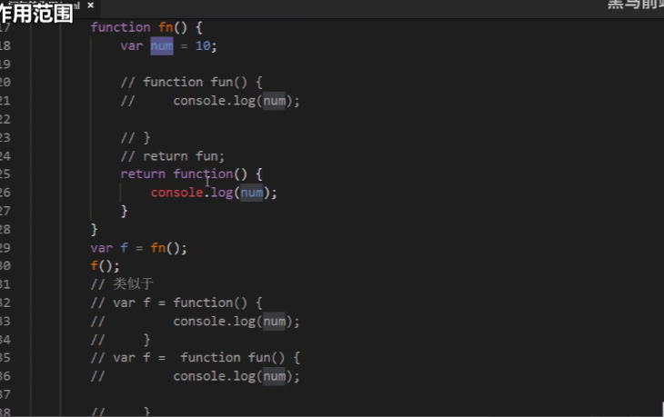

# 6.递归函数

函数内部自己调用自己,要加入退出循环条件,否则将陷入死循环

~~~js
  // (function(n) {
        //     let sum = 1
        //     for (let i = 1; i <= n; i++) {
        //         sum = sum * i
        //     }
        //     console.log(sum);
        // }(3))
        function fn(n) {
            //退出循环条件
            if (n === 1) {
                return 1
            }
            return n * fn(n - 1)
        }
        console.log(fn(5))
~~~

## 1.浅拷贝和深拷贝

### (1)浅拷贝assign

~~~js
//1.浅拷贝
Object.assign(目标对象,被拷贝对象)//

~~~

### (2)深拷贝

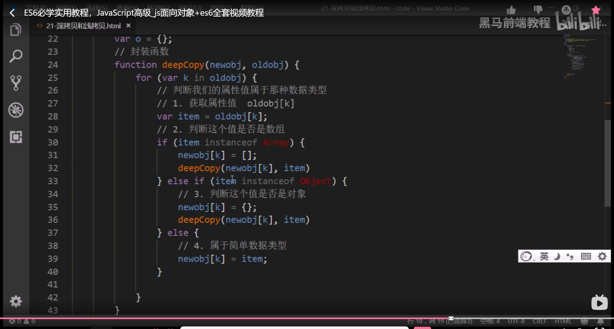

