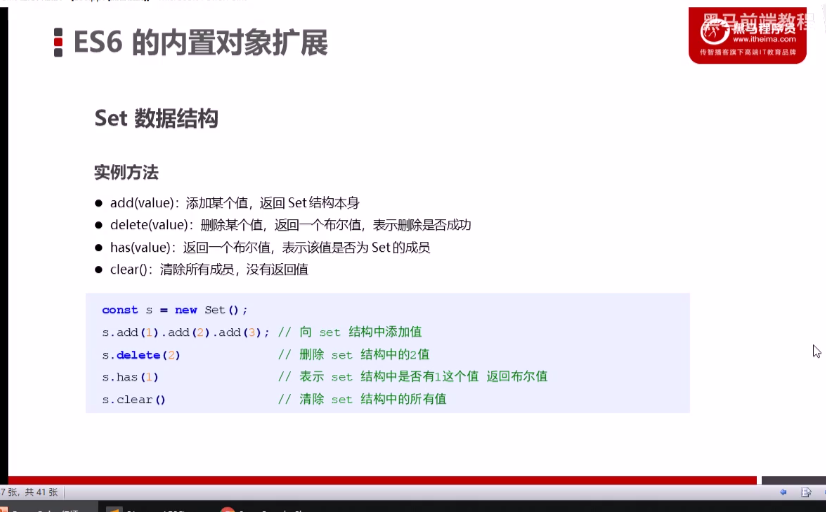

# ==ES6新增语法==

## 1.声明变量区别

.png)

## 2.数组解构赋值

## 3.箭头函数

~~~js
(形参)=>{}(实参)
let sum = (num1,num2)=>{
    return num1+num2
}
console.log(sum(1,2))
//简写法--要求:函数体中只有一句代码,执行结果就是函数返回值
let sum = (num1,num2)=> num1 + num2
console.log(sum(1,2))

~~~

如果形参只有一个,形参外()可以省略

~~~js
let fn=num => {
    alert('就一个参数')
}
fn()
~~~

### 1.this关键词

没有自己的this关键字,如果有this则指向内部定义的this

## 4.剩余参数

### 1.解构配合使用

## 5.内置扩展对象

### 1.Array的扩展方法

#### (1)将数组拆分成以逗号分割的参数序列

~~~js
let arr3 = [1, 2, 3]
        console.log(1, 2, 3); //1 2 3
        console.log(...arr3); //1 2 3
        console.log(arr3);
        console.log(arr3[0]);
~~~

#### (2)合并数组

方法1:

~~~js
 let arr1 = [1, 2, 3]
        let arr2 = [4, 5, 6]
        arr1.push({
            name: 'z张鹏举'
        })
        let arr3 = [...arr1, ...arr2]
        console.log(...arr3); //得到1 2 3 4 5 6
        //相当于
        console.log(1, 2, 3, 4, 5, 6); //1 2 3 4 5 6
~~~

方法2:

~~~js
//用数组增加方法
arr.push(新增数据)
~~~

#### (3)将伪数组转化为真数组[...ary]

便于调用数组方法

~~~js
let divs =document.getElementTagName('div')
console.log(divs)//获得的是伪数组
var ary = [...divs]//转化数组
console.log(ary)//得到真数组
~~~

#### (4)构造函数方法:Array.from()

Array.from(要转化数组,处理元素--函数)

#### (5)查找符合条件的数组成员:ary.find(参数)

返回的是对象形式/undefined

~~~js
let ary =[{
        name:'张三',
        id:1
    },{
        name:'关羽',
        id:2
    }]
let target = ary.find(item=>item.id===2)
//完整写法
//ary.find((item)=>{
//    return item.id===2
//})
console.log(target)//返回值是Object形式
~~~

#### (6)实例方法:findIndex()

#### 找出第一个符合条件元素的位置index,没有则返回的是-1

~~~js
 let ary = [2, 436, 756, 5]
 let arr = ary.findIndex(value => value > 9)
 console.log(arr);//1,索引号为1的位置
~~~

#### (7)实例方法:includes()

#### 表示数组是否包含某个给定的值,返回的是Boolean值

~~~js
console.log([1,23,4].includes('4'))//true 
~~~

### 2.模板字符串  ` `

#### 反引号`  `

### 3.String扩展方法

#### (1)startsWith()和endsWith()

#### 是否以某字符串开始和结尾,返回的是Boolean值

#### (2)repeat()

#### 将某字符串重复次数

~~~js
'zpj'.repeat(3)//输出:zpjzpjzpj
~~~

### 4.set数据结构--构造函数

### 成员的值都是唯一的,没有重复

- 本身是构造函数
- 可接受一个数组作为参数来初始化

~~~js
//Set本身是构造函数
let set = new Set()
//数据不重复
let ary =[1,2,3,3,4]
let set = new Set(ary)
console.log(set.size)//4
~~~

#### 1.实例方法

~~~js
//增加数据
add()
//删除数据
delete()
//判断摸个数据是否是数组成员
has()
//清除所有值
clear()
~~~

