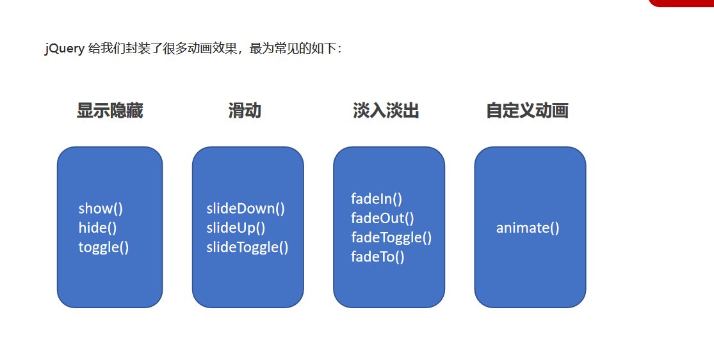
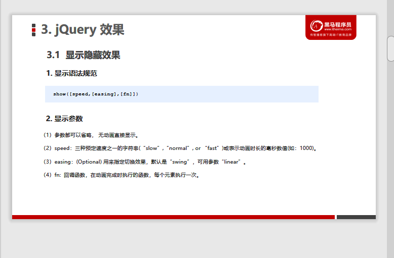
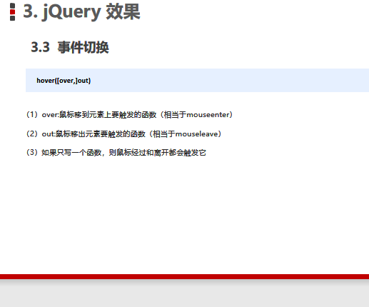
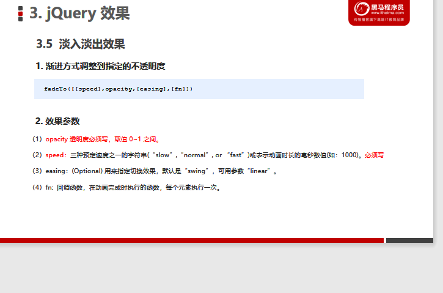
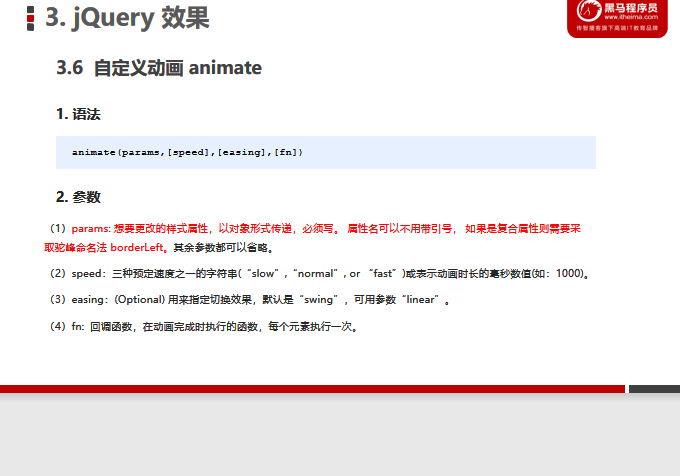

# [PPT01](D:\2022最新版黑马程序员前端学习路线图\2. 第二阶段 技术进阶\jQuery网页开发案例精讲-pink\jQuery网页开发案例精讲资料\jQuery 第一天资料\PPT)

# 1.jQuery概述

其实就是JS库--JS文件,js代码进行了封装,存放到里面,直接调用

常见的js库:

# 2.jQuery概念

实质就是JS库--js文件

## 1.优点

## 2.jQuery下载

[jQuery下载](https://jquery.com/download/)

## 3.jQuery使用

- 引入jQuery

  [jquery-3.6.0.min.js](https://code.jquery.com/jquery-3.6.0.min.js)

   

  ~~~js
  //引入jQuery文件  
  
      
  </head>

  <body>
       //先加载完DOM页面,在执行代码,DOM写在jQuery代码上面
      

      
  </body>
  ~~~

- jQuery入口函数

  ~~~js
  //方法1:
  $(function(){
      //此处是DOM页面加载完成的入口
  })
  //方法2:
  $(document).ready(function(){
      //入口
  })
  ~~~

  

  相当于原生js中DOMContentLoaded

# 3.jQuery基本使用

## 1.顶级对象$

~~~js
$是jQuery的顶级对象//jQuery可替代
~~~

## 2.jQuery对象和DOM对象

jQuery对象--是用$把DOM元素包装,有自己独有的属性和方法(区别于原生JS的属性和方法)

#### (1)两者可以相互转换

~~~js
//DOM元素转化为jQuery对象
$('元素')
//jQuery对象转化为DOM对象,可以运用原生js属性和方法
$('元素')[0] 或者 $('元素').get(0)
~~~

# 4.jquery常用API

## 1.选择器--基础,层级,筛选,**<u>*筛选方法*</u>**

- 基础选择器

- 层级选择器

  

- 筛选选择器

  

- **筛选方法**

  

​       parents('选择器')--得到所有父级元素,查找指定父级元素

#### (1)**隐式迭代**--遍历DOM元素的过程

遍历元素,相同操作

####  (2)排他思想--运用隐式迭代

~~~js
 
    <button>快速</button>
    <button>快速</button>
    <button>快速</button>
    <button>快速</button>
    <button>快速</button>
    <button>快速</button>
    <button>快速</button>
~~~

#### (3)链式编程

~~~js
 $(function() {
     //点击事件
     $('button').click(function() {
         $(this).css('background', 'red').siblings().css('background','#ccc')    
        })
~~~

## 2.样式操作

### 1.操作css方法

修改属性时,属性名和属性值都要加引号' ',中间,隔开

~~~js
$('button').css('color','red')
~~~

**多个属性可以以对象形式呈现{}**

- 属性名可以不加引号,数字可以不用加
- 复合属性--用驼峰命名法

~~~js
$('button').css({
    backgroundColor: 'red',
    width:200//数字可以不用加引号,自己自动识别
})
~~~

## 3.操作类样式修改属性

## *addClass,removeClass,toggleClass*

<u>!注意区别于原生JS类操作属性</u>

~~~js
 $(function() {
            $('.tab_list ul li').click(function() {
                //当前元素添加类名,其他兄弟元素删除此类名
                $(this).addClass('current').siblings().removeClass('current')
                    //获取当前点击元素的索引号
                let index = $(this).index()
                console.log(index);
                //jQuery筛选方法eq(索引号)
                //css属性添加,可以以对象形式添加多个属性{}
                $('.tab_con .item').eq(index).css({
                    display: 'block'
                }).siblings().css({
                    display: 'none'
                })
            })
        }
~~~

## 4.jQuery效果

### 1.显示<u>show</u>和隐藏效果<u>hide</u>

~~~js
//显示
//speed:动画时长;easting:切换效果;fn:动画完成时调用函数
show([speed],[easting],[fn])
//隐藏
hide()
//切换
toggle()
~~~

### 2.滑动效果**<u>slide</u>**和事件切换**<u>hover</u>**

- slideDown()下滑
- slideUp()上滑
- slideToggle()滑动切换

#### (1)事件切换hover

### 3.停止动画排队stop()

.png)

### 4.淡入淡出及突出显示fade

- fadeIn()

- fadeOut()

- fadeToggle()

- fadeTo()

  

### 5.自定义动画animate

~~~js
animate(params,[speed],[easting],[fn])
~~~

~~~js
  $(function() {
            $('.king ul li').mouseenter(function() {
                //当前元素
                //stop()停止动画排列
                //find('选择器')---相当于('ul>li')
                $(this).stop().animate({
                        width: 224
                    }).find('.big').stop().fadeIn().siblings('.small').stop().fadeOut()
                    //兄弟元素
                $(this).siblings().stop().animate({
                    width: 69
                }).find('.small').stop().fadeIn().siblings('.big').stop().fadeOut()
            })
        })
~~~

## 5.附加内容

### 截取字符串subStr(数字)--获取部分数据

  用于获取从指定索引号/下标开始的数据

~~~js
let num = '¥ 18.66'
num.subStr(1)//输出18.66,从下标1开始截取字符串,注意区别原生JS的parseInt获取
~~~

-  subString(下标)

  用于获取两个制定下标之间的字符

  ~~~js
  let num = 1545436835
  num.toString(0)//从索引号0开始获取,输出1545436835
  num.toString(0,2)//获取索引号0和2之间的下标,输出5
  ~~~

### 保留几位小数toFixed(数字)

~~~js
let num = 15.888888888
num.toFixed(2)//输出15.88
~~~

