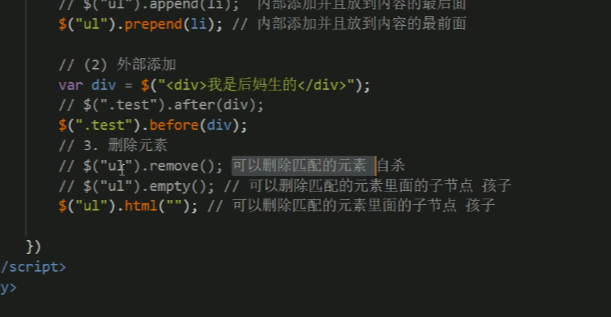

# [PPT02](D:\2022最新版黑马程序员前端学习路线图\2. 第二阶段 技术进阶\jQuery网页开发案例精讲-pink\jQuery网页开发案例精讲资料\jQuery 第二天资料\PPT\01-jQuery 常用API.pptx)

# *<u>[案例--购物车](F:\4月web前端\2022黑马-web前端学习\6.jQuery\2.案例\02-购物车素材\index.html)</u>*

# <u>[案例--电梯导航栏](F:\4月web前端\2022黑马-web前端学习\6.jQuery\2.案例\09-电梯导航\index.html)</u>

# <u>[附加内容--节流阀](https://blog.csdn.net/weixin_44703582/article/details/123397430?utm_medium=distribute.pc_relevant.none-task-blog-2~default~baidujs_baidulandingword~default-0-123397430-blog-119516119.pc_relevant_multi_platform_whitelistv2&spm=1001.2101.3001.4242.1&utm_relevant_index=2)</u>

#### *防止执行动画时,出现抖动情况*

# 1.jQuery属性操作

## 1.获取固有属性prop()

- 获取属性值prop('属性名')

~~~js
console.log($('a').prop('href'))//输出a的地址
~~~

- 设置属性语法

  prop('属性名','属性值')

~~~js
console.log($('a').prop('href','baidu.com'))
~~~

## 2.获取自定义属性attr()-- 用户自己添加的属性

- 获取属性

  ~~~js
  attr('属性名')
  ~~~


- 设置属性

  ~~~js
  attr('属性','属性值')
  ~~~

## 3.数据缓存data()

指定元素存取数据,不会修改DOM元素结构,页面刷新,存放数据移除

~~~js
//附加属性
$('span').data('uname','黑马')
//获取附加
$('span').data('uname')//黑马
~~~

# 2.jQuery内容文本值

- html()--文本值,相当于原生JS的innerHTML()
- text()
- val()--表单值,相当于value


## !!5.附加内容--表单运用

### 截取字符串subStr(数字)--获取部分数据

  用于获取从指定索引号/下标开始的数据

```js
let num = '¥ 18.66'
num.subStr(1)//输出18.66,从下标1开始截取字符串,注意区别原生JS的parseInt获取
```

-  subString(下标)

  用于获取两个制定下标之间的字符

  ```js
  let num = 1545436835
  num.toString(0)//从索引号0开始获取,输出1545436835
  num.toString(0,2)//获取索引号0和2之间的下标,输出5
  ```

### 保留几位小数toFixed(数字)

```js
let num = 15.888888888
num.toFixed(2)//输出15.88
```

# 3.元素操作

## 1.遍历元素each(参数)--each(index,element)

第一个参数是索引号,二个是元素

## 2.遍历元素$.each(Object/array,fn(index,ele){})

~~~js
  let arr = [1, 'zpj', 34, 'wang']
            $.each($('button'), function(index) {
                console.log(index); //0 1 2 3
            })
            $.each(arr, function(index, ele) {
                console.log(index);//0123
                console.log(ele);//arr数据
            })
~~~

## 3.创建元素--后需要添加到元素中

~~~js
        let li = $('<li>我是创建的</li>')
~~~

### 1.添加元素:内部和外部

- 内部添加--父子级关系

  ~~~js
          $('ul').append(li)//添加元素到后面
          $('ul').prepend(li1)//到前面
  ~~~


- 外部添加--兄弟关系

  ~~~js
          $('ul').before(div) //添加到元素的上面
          $('ul').after(div) //添加到元素的下面
  ~~~

### 2.删除元素<u>remove()</u>,<u>empty()</u>,<u>html(' ')</u>



# 4.尺寸、位置操作

## 1.尺寸操作--width,height


- width()--元素宽高
- innerWidth()--包含padding
- outerWIdth()--包含padding,border
- outerWidth(true)--包含padding,border,margin

## 2.位置--offset,position,scrollTop

- offset()

  相对文档位置的偏移量,跟父级没有关系

      


- position()--相对父级偏移量

  只能获取值,不能设置值

- scrollTop()--设置或获取元素被卷去的部分

  ~~~js
         $(window).scroll(function() {
                      //卷去部分大于div的相对页面偏移量,p显示
                      if ($(this).scrollTop() >= $('div').offset().top) {
                          $('p').fadeIn()
                      } else {
                          $('p').fadeOut()
                      }
                  })
                  //点击返回顶部
              $('p').click(function() {
                  //自定义动画animate,修改元素属性以对象形式
                  $('body,html').stop().animate({
                      scrollTop: 0
                  })
            })
  ~~~

  ​


