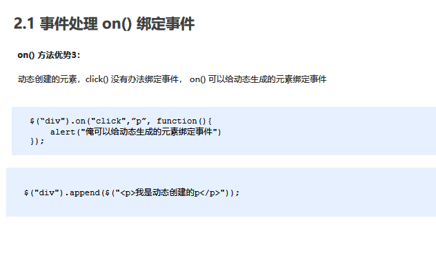
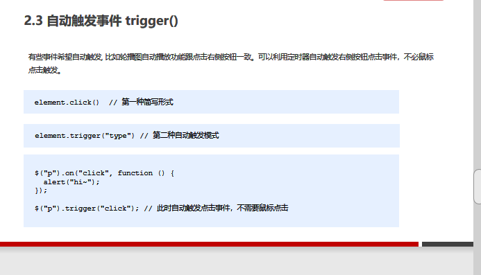
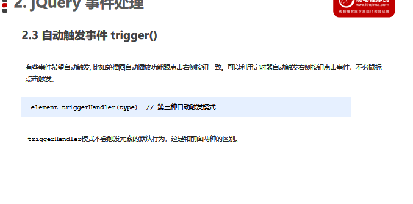
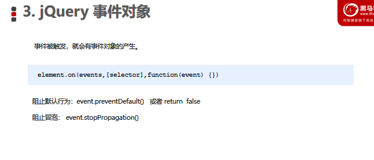
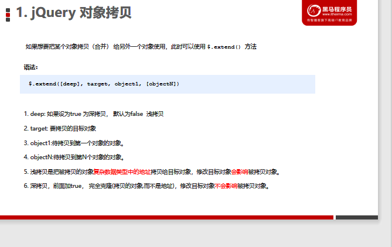
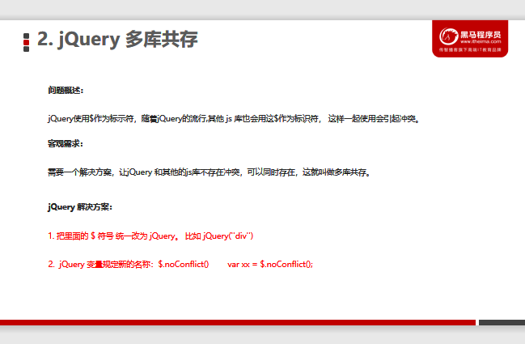
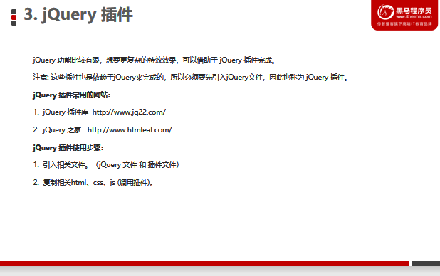
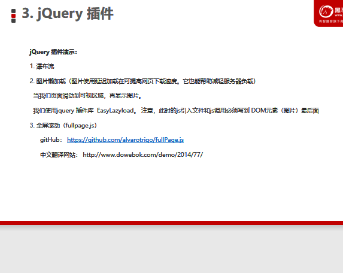

# [PPT](D:\2022最新版黑马程序员前端学习路线图\2. 第二阶段 技术进阶\jQuery网页开发案例精讲-pink\jQuery网页开发案例精讲资料\jQuery 第三天资料\PPT)

# [案例--微博发布](F:\4月web前端\2022黑马-web前端学习\6.jQuery\1.练习\day02\07微博发布.html)

# 1.事件注册

## 1.单个事件注册

~~~js
element.事件(function(){
    //函数体
})//动态创建的元素,这种方式不能绑定事件,通过on()
$('元素').事件(function(){
    //函数体
})
~~~

# 2.事件处理

## 1.绑定事件on()

## 匹配元素上绑定一个或多个事件处理函数

~~~js
$('element').on('事件',[selector元素子选择器],fn)
~~~

.png)

### (1)绑定多个事件--合并处理

~~~js
$('button').on({
    mouseenter:fn,
    mouseleave:fn
})
//如果事件处理程序相同
$('button').on('mouseenter mouseleave',fn)
~~~

### (2)委派操作

### 把原来给子元素绑定的事件,委派给父元素身上

~~~js
$('父lement').on('事件','子元素',fn)
~~~

### (3)绑定动态创建的事件--通过父元素委派

## 2.解绑事件off()

.png)

## 3.自动触发事件trigger()

# 3.事件对象events

# 4.对象拷贝$.extend()

# 5.多库共存--标识符$

# 6.jQuery插件

## bootstrap JS 插件：

### bootstrap 框架也是依赖于 jQuery 开发的，因此里面的 js插件使用 ，也必须引入jQuery 文件。

- [jQuery插件库](http://www.jq22.com/)
- [jQuery之家](http://www.htmleaf.com/)
- [全屏滚动](http://www.dowebok.com/demo/2014/77/)