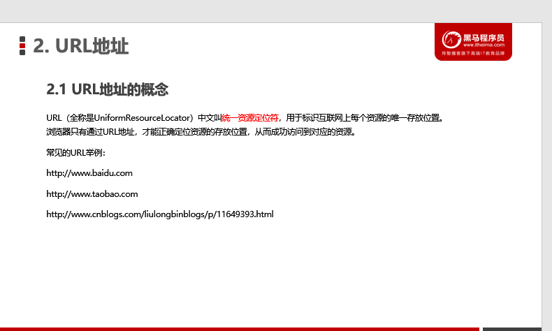
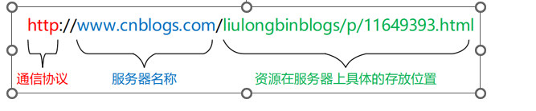
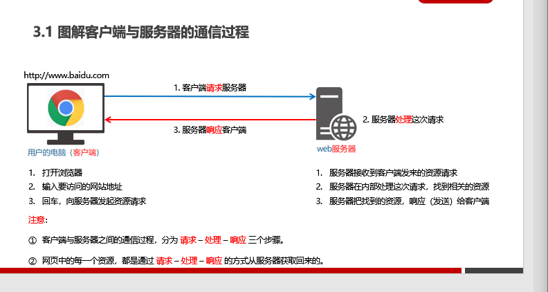
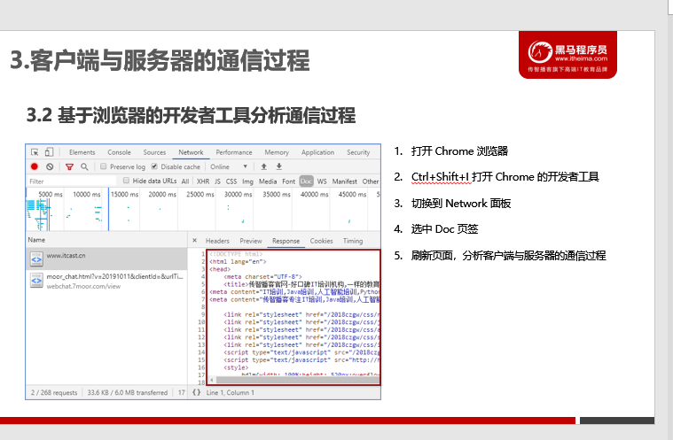
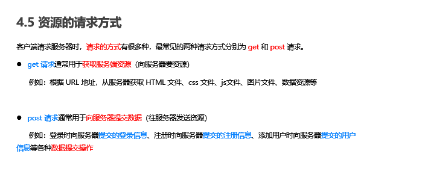
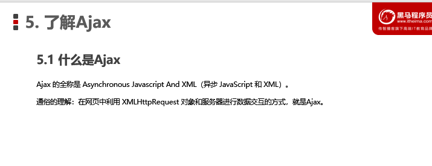
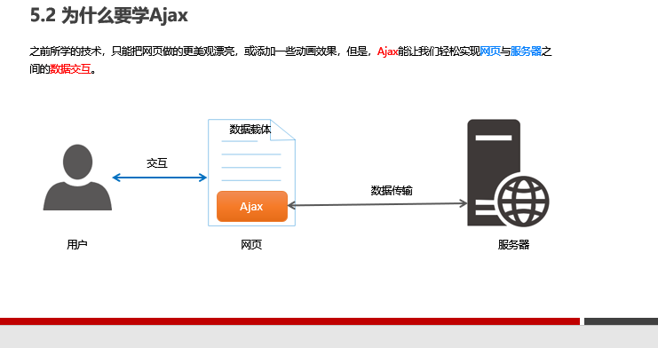
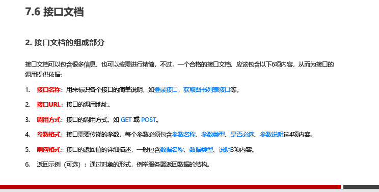

# [PPT01](D:\2022最新版黑马程序员前端学习路线图\2. 第二阶段 技术进阶\3.Ajax零基础入门\Ajax\Ajax—资料\day1\day1\ppt\01_服务器的基本概念与初识Ajax.pptx)

# **[案例--图书管理](F:\4月web前端\2022黑马-web前端学习\7.Ajax和git( 涵盖了 Ajax、跨域、JSONP、模板引擎、节流防抖、XHR Level2 等常用技术)\2.案例\lib\图书管理.html)**

# 1.客户端与服务器

## 服务器

上网过程中,负责存放和提供资源的电脑

## 客户端

负责获取和消费资源的电脑

# 2.URL地址

## 1.概念

## 2.URL组成部分

# 3.网页打开过程

## 请求>出路>响应

1. 客户端向服务器发送请求
2. 服务器处理客户端的请求
3. 响应客户端的请求

# 4.服务器对外提供的资源

image,audio,video,数据.....

## 1.资源的请求方式

- get()--获取服务器端的资源
- post()--向服务器提交资源

# 了解Ajax

# 1.定义

网页中利用XMLHttpRequest对象和服务器进行数据交互的方式,就是Ajax

# 2.学习Ajax意义

# 3.jQuery中的Ajax

## 1.$.get()

### 语法:$.get(url,[data],[callback])

~~~js
//url--请求时的资源地址,必须有
//[data]--获取资源的参数.不必须有
//回调函数,不必须有
$.get(url,[data],[callback])
//例子
$.get('http://www.liulongbin.top:3006/api/getbooks', function(res){
    console.log(res)//res是服务器返回额数据
})
~~~

## 2.$.post()

### 语法:$.post(url, [data], [callback])

~~~js
$.post('http://www.liulongbin.top:3006/api/addbook',{
    bookname:'从你的全世界路过',
    author:'新野',
    publisher:'清华大学出版社'
},function(res){
    console.log(res)
})
~~~

## 3.$.ajax()--综合性能

### 语法:

~~~js
$.ajax({
    type:'请求方式',//Get或者POST
    url:'资源地址',
    data:{},//请求的数据
    //请求成功后的回调函数
    success:function(res){
        //函数体
    }
})
~~~

方式.png)

# 4.接口

## 1.概念

使用Ajax请求数据时,被请求的URL地址--数据接口,每个接口必须有请求方式

## 2.接口测试工具postman下载

### [postman链接](https://www.getpostman.com/downloads/)

## 3.接口文档--接口的说明文档,调用接口的依据

