# [PPT02](D:\2022最新版黑马程序员前端学习路线图\2. 第二阶段 技术进阶\3.Ajax零基础入门\Ajax\Ajax—资料\day2\day2\ppt\02_form表单与模板引擎.pptx)

# <u>***[发布评论案例](F:\4月web前端\2022黑马-web前端学习\7.Ajax和git( 涵盖了 Ajax、跨域、JSONP、模板引擎、节流防抖、XHR Level2 等常用技术)\2.案例\day02\发表评论案例\lib\发表评论.html)***</u>

# <u>*[新闻发布案例](C:\Users\ASUS\Desktop\案例-新闻列表\案例-新闻列表02.html)*</u>

# ..................................................

# **form表单基本使用**

## 1.什么是表单

用来数据采集,采集用户输入信息,通过form标签提交操作,采集信息提交到服务器进行处理

## 2.表单组成

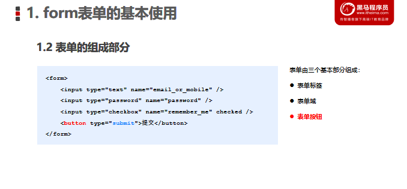

- 表单标签--<form>

- 表单域--<input type="text">

  包含文本框,密码框....

- 表单按钮

## 3.form标签的属性

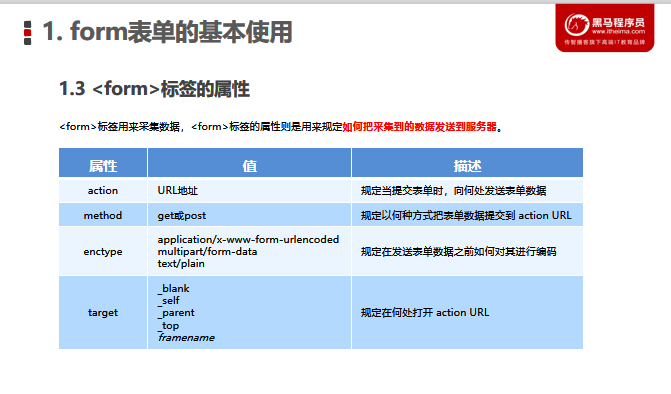

- action--提交数据的url地址

- method--提交数据方式get/post

  1. get--提交少量的简单数据
  2. post--大量而复杂的数据

- enctype

  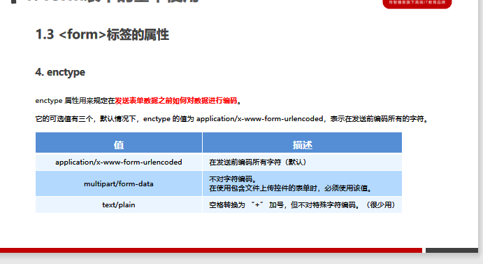

- target--打开url方式

  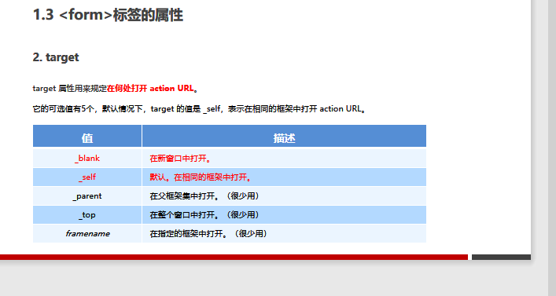

## 4.表单同步提交及缺点

### 1.表单同步提交概念

通过submit按钮,触发表单提交操作,从而使页面跳转到action URL的行为

### 2.同步提交的缺点

整个页面跳转,页面之前状态和数据丢失

# .................................

# **通过Ajax提交表单数据**

## 1.监听表单提交数据

~~~js
//jQuery中监听事件
$('form表单').submit(function(){
    //函数体
})
//2.或者
$('button').on('submit',function(){
    //函数体
})
~~~

## 2.阻止表单默认提交行为--e.preventDefault()

~~~js
$('form').on('submit',function(e){
    e.preventDefault()//阻止默认提交行为
})
~~~

## 3.快速获取表单中数据--serialize()

### <u>**!必须为每一个表单元素添加name属性**</u>

### --语法:

~~~js
//可以一次性获取表单所有数据
//必须为每一个表单元素添加name属性
$('选择器selector').serialize()
~~~

### --例子:

~~~js
 <form action="">
        <input type="email" name="email" id="">
        <input type="text" name="text" id="">
        <button type="submit">提交</button>
    </form>
    
~~~

# ..............................

# 模板引擎的基本概念

## 1.渲染UI结构时遇到的问题

拼接字符串麻烦

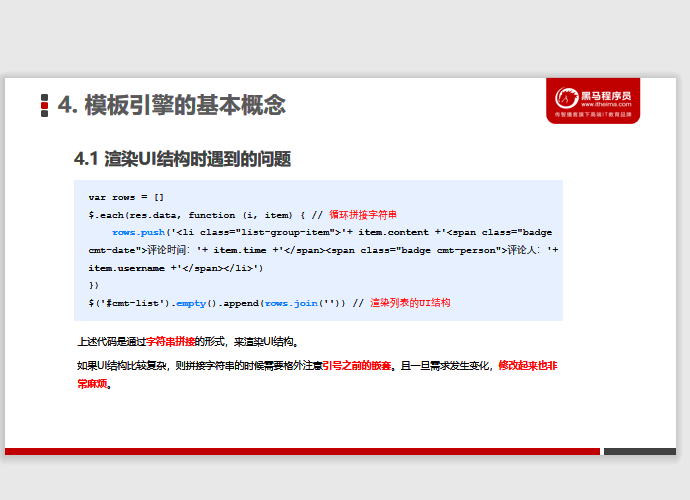

## 2.模板引擎

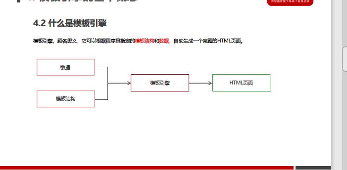

### 1)优点

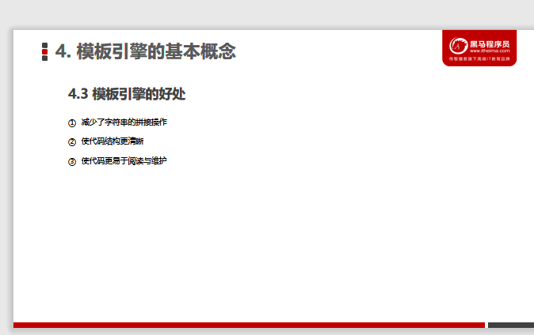

# ....................................................

# art-template模板引擎--[*网址链接*](http://aui.github.io/art-template/zh-cn/index.html)

##### *<u>[案例](F:\4月web前端\2022黑马-web前端学习\7.Ajax和git( 涵盖了 Ajax、跨域、JSONP、模板引擎、节流防抖、XHR Level2 等常用技术)\2.案例\评论列表\index02(template).html)</u>*

## 1.标准语法--{{变量}}

~~~js
{{变量}}
~~~

### (1)原文输出{{@ value}}

~~~js
//输出的值包含html标签结构的
{{@ 变量}}
~~~

### (2)条件输出if

~~~js
{{if value}} 输出内容 {{/if}}
{{if value}} 输出内容 {{else if value}} 输出内容 {{/if}}
~~~

### (3)循环输出each

~~~js
{{each 数组}}
   {{$index索引号}}  {{$value}}
{{/each}}
~~~

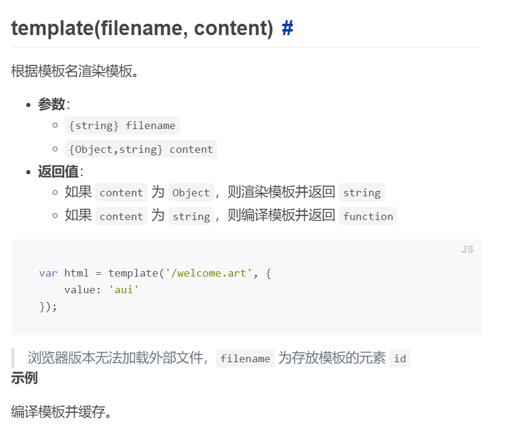

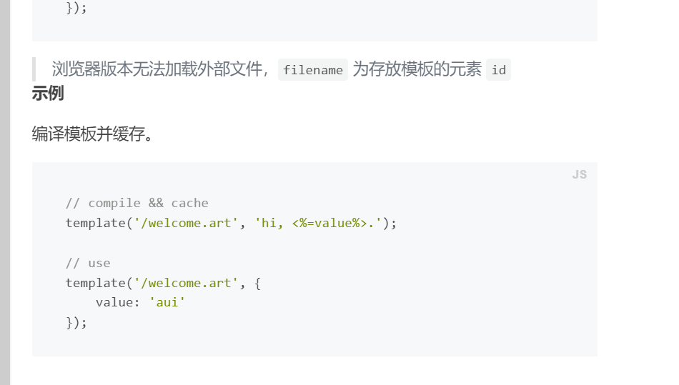

### (4)过滤器

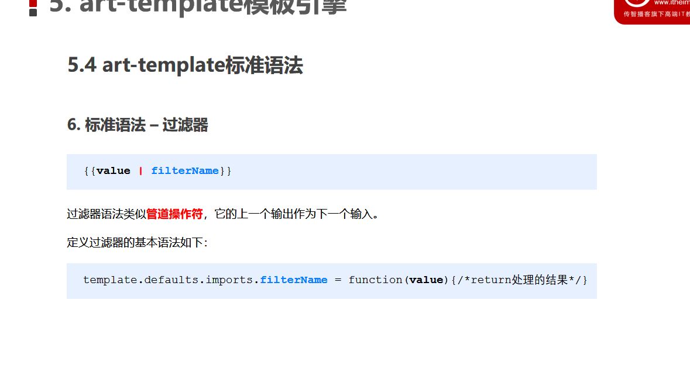

~~~js
//value是要处理过滤的数据
//value传输给filterName,进行处理
~~~

##### *定义过滤器

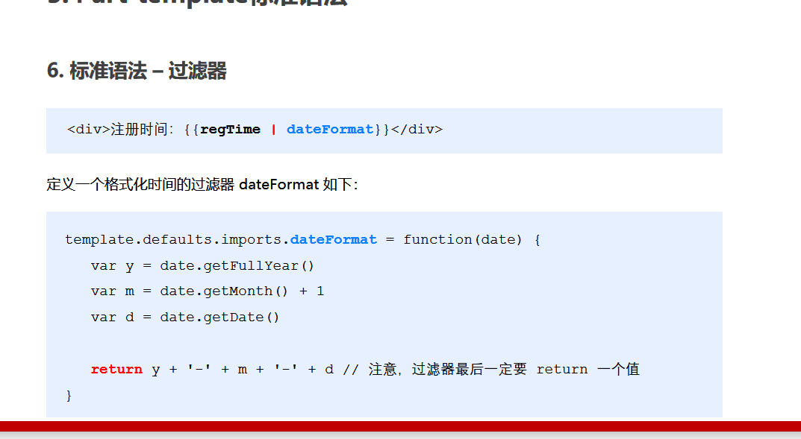

~~~js
//date形参其实就是传送过来的regTime值(实参)
~~~

# ................................................

# 模板引擎实现原理

### [正则表达式(笔记)](F:\4月web前端\2022黑马-web前端学习\4.JS_WebAPI-DOM\4.上课笔记\day07.md)

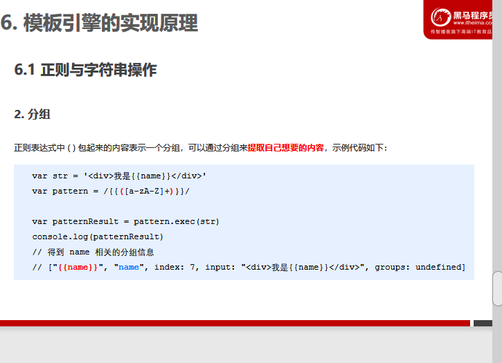

~~~js
//表示大小写字母可以重复一次或多次
// []里,-表示连字符,[a-z]任意小写字母
// +表示重复一次或多次
let regExp =/[a-zA-Z]+/ 
~~~

## 1.封装template函数

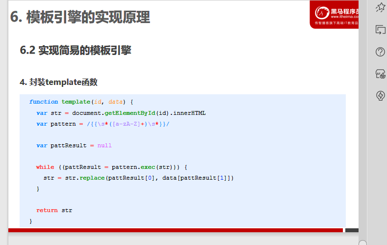

