# [PPT03 Ajax加强](D:\2022最新版黑马程序员前端学习路线图\2. 第二阶段 技术进阶\3.Ajax零基础入门\Ajax\Ajax—资料\day3\day3\ppt\02_Ajax加强.pptx)

# ..........................

# XMLHttpRequest基本使用xhr

## 1.定义

浏览器提供的JS对象,可以请求服务器上的数据资源,Ajax是基于xhr对象封装的

~~~js
   //创建xhr实例化对象
        let xhr = new XMLHttpRequest()
            //xhr获取数据
         //请求具体数据,url地址后跟  (?属性)
        xhr.open('get', 'http://www.liulongbin.top:3006/api/getbooks')
            //xhr函数调用,发起请求
        xhr.send()
            //监听事件
        xhr.onreadystatechange = function() {
            if (xhr.readyState !== 4 && xhr.status !== 200) return alert('获取失败')
            console.log(xhr);
            console.log(xhr.response); //JSON字符串形式
            console.log(xhr.responseText);
            console.log(JSON.parse(xhr.response));
            console.log(JSON.parse(xhr.responseText));
        }
~~~

## 2.xhr对象的readyState属性

### *表示Ajax请求数据的所处状态*

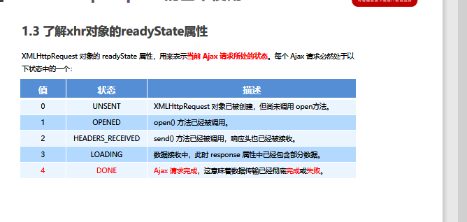

## 3.使用xhr发起带参数的GET请求(<u>**?属性**</u>)

url地址后拼接的参数,叫做查询字符串

~~~js
            //请求具体数据,url地址后跟  (?属性)
xhr.open('get','http://www.liulongbin.top:3006/api/getbooks?id=1')
~~~

#### (1).查询字符串

多个参数以<u>**&**</u>隔开

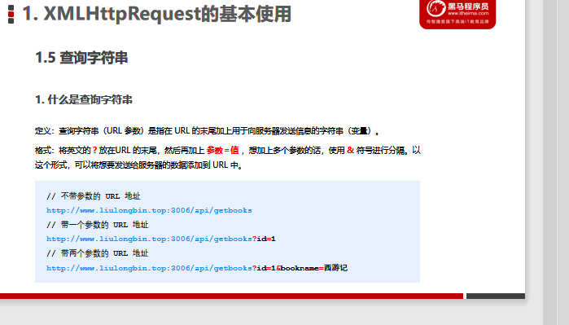

## 4.URL编码与解码

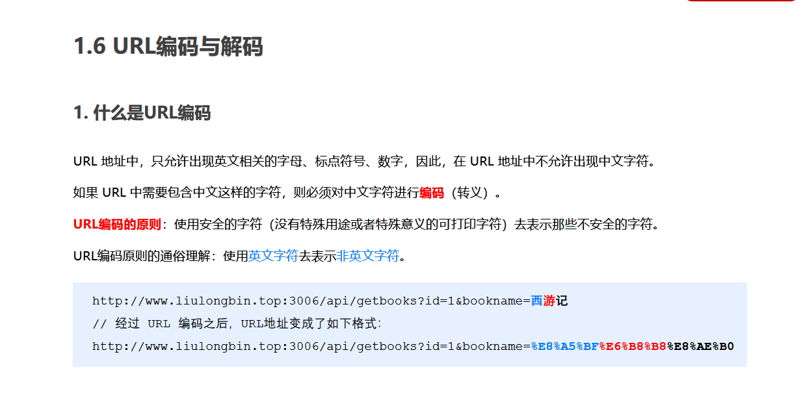

- URL编码--encodeURL('参数')
- URL解码--decodeURL(' %E9%BB%91%E9%A9%AC%E7%A8%8B%E5%BA%8F%E5%91%98')

## 5.使用xhr发起post请求

~~~js
 let xhr = new XMLHttpRequest()
        xhr.open('POST', 'http://www.liulongbin.top:3006/api/addbook')
        xhr.setRequestHeader('Content-Type', 'application/x-www-form-urlencoded')
//添加内容,带入参数
        xhr.send('bookname=全结束了&author=来来&publisher=你')
        xhr.onreadystatechange = function() {
            if (xhr.readyState !== 4 && xhr.status !== 200) return alert('添加失败')
            console.log(xhr.response);
            console.log(xhr.responseText);
        }
~~~

# .......................

# 数据交换格式(XML和JSON)

服务器与客户端进行数据传输与交换的格式(两方式:XML和JSON)

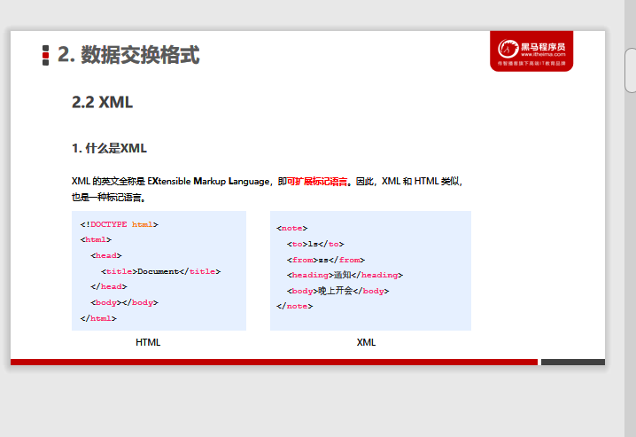

##  1.两者区别:

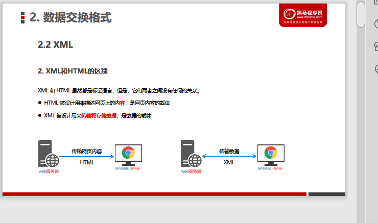

## 2.JSON定义--实际是string类型

### *用字符串表示JS的对象和数组*

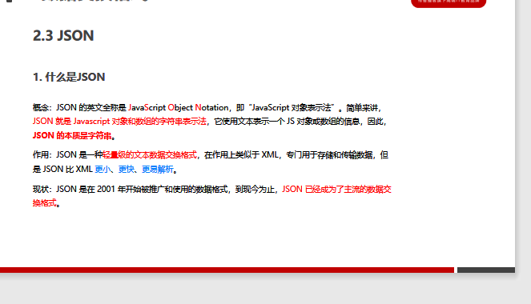

### (1)两种结构--object和Array:

- 对象结构

  ~~~js
  {
      "name":"zpj",
       "age":18,
       "address":"老舍",
       "hobby":["str1","str2"],
       "sex":underfined//underfined不用加""
  }
  ~~~

  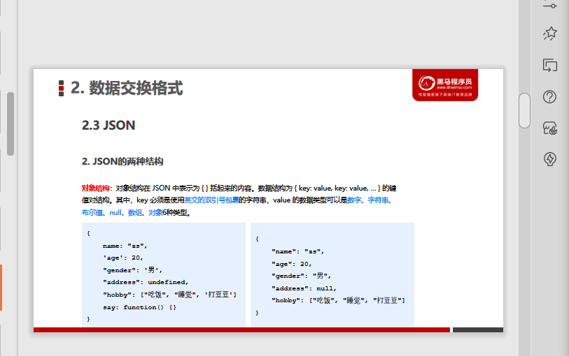

- 数组结构

  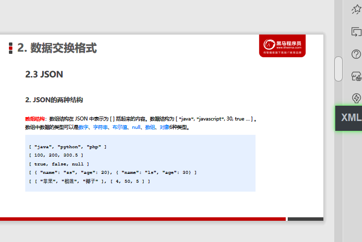

### (2)使用注意点:

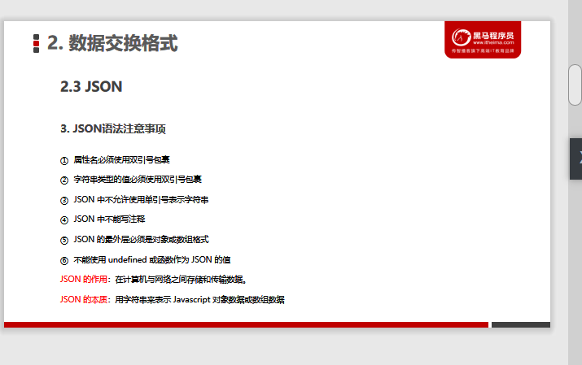

### (3)JSON和JS对象的互转

- #### JSON反序列化--JSON字符串转化为JS对象JSON.parse()

  ~~~js
  var obj = JSON.parse('{"a": "Hello", "b": "World"}')
  //结果是 {a: 'Hello', b: 'World'}
  ~~~

- #### JSON序列化--JS对象转化为JSON字符串 JSON.stringify()

  ~~~js
  var json = JSON.stringify({a: 'Hello', b: 'World'})
  //结果是 '{"a": "Hello", "b": "World"}'
  ~~~

# 封装自己的Ajax函数

# ..........................

# XMLHttpRequest Level2的新特性:

## --旧版缺点:

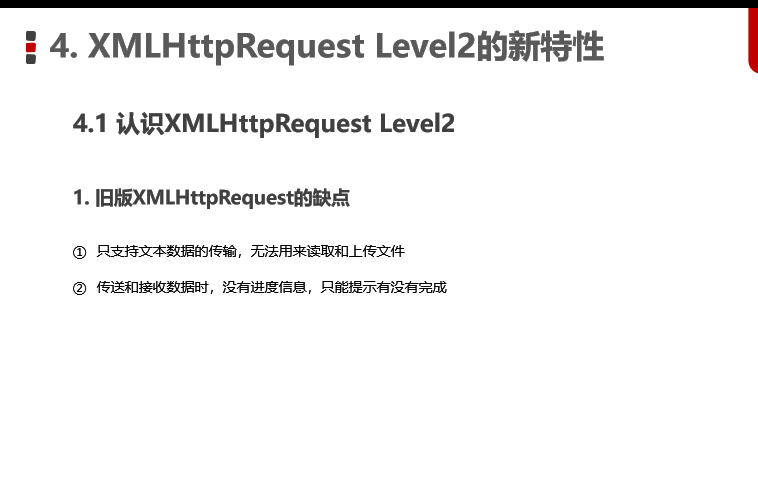

## --L2新增功能

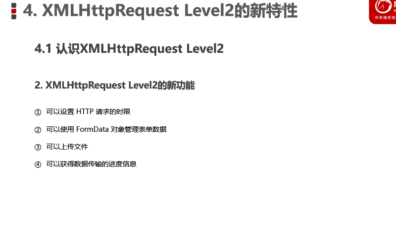

### 1.设置Http请求时限

- 时间最长等待='时间',过了时间自动停止http请求

~~~js
xhr.timeout = 时间
~~~

- 指定回调函数

~~~js
xhr.ontimeout = function(){
    //请求时限内的回调函数
}
~~~

### 2.FormData对象管理表单数据

### 3.上传文件

~~~js
//传送文件post
let fd = new FormData()
//给FormData追加文件
fd.append('属性名','属性值')
let xhr = new XMLHttpRequest()
xhr.open('POST',url)
//向xhr发送文件上传请求
xhr.send(fd)u
//监听onreadystatechange事件
xhr.onreadystatechange = function (res){
    //操作函数体
}
~~~

### 4.显示文件上传进度

#### <u>*([案例-显示上传进度](F:\4月web前端\2022黑马-web前端学习\7.Ajax和git( 涵盖了 Ajax、跨域、JSONP、模板引擎、节流防抖、XHR Level2 等常用技术)\1.练习\day03\08显示上传进度.html))*</u>

- 监听上传进度事件

~~~js
//监听上传进度事件
xhr.onload.onprogress = function (e){
    // e.lengthComputable 是一个布尔值，表示当前上传的资源是否具有可计算的长度
    if (e.lengthComputable) {
        // e.loaded 已传输的字节
        // e.total  需传输的总字节
var percentComplete = Math.ceil((e.loaded / e.total) * 100)
    }  
}
~~~

- 监听上传完成的事件

~~~js
 xhr.upload.onload = function() {
     $('#percent')
         // 移除上传中的类样式
         .removeClass()
         // 添加上传完成的类样式
         .addClass('progress-bar progress-bar-success')
 }
~~~

# ..................................

# jQuery高级用法

###### <u>***[案例上传文件JQuery高级](F:\4月web前端\2022黑马-web前端学习\7.Ajax和git( 涵盖了 Ajax、跨域、JSONP、模板引擎、节流防抖、XHR Level2 等常用技术)\1.练习\day03\09jquery高级用法-loading.html)***</u>

~~~js
 $.ajax({
     method: 'POST',
     data: fd,
     // 不修改 Content-Type 属性，使用 FormData 默认的 Content-Type 值
     contentType: false,
     // 不对 FormData 中的数据进行 url 编码，而是将 FormData 数据原样发送到服务器
     processData: false,
     success: function(res) {
         console.log(res)
     }
 })
~~~

## 1.jQuery实现loading效果

### \请求Ajax时的执行函数

~~~js
$(document).ajaxStart(function(){
    //执行函数
})
//监听的是当前文档内所有Ajax的请求
~~~

### \请求Ajax结束时的执行函数

~~~js
$(document).ajaxStop(function(){
//执行函数
})
~~~

# ..................................

# axios库

## 1.定义:

~~~html
Axios 是专注于网络数据请求的库。
相比于原生的 XMLHttpRequest 对象，axios 简单易用。
相比于 jQuery，axios 更加轻量化，只专注于网络数据请求。
~~~

## 2.语法(3种):

- get获取数据请求

~~~js
axios.get('url',{'params':'参数'}).then(callback回调函数)
~~~

- post上传数据请求

~~~js
axios.post('url地址',{data}).then(callback)
~~~

- axios直接发送请求(相当于jQuery中$.ajax())

~~~js
axios({
     method: '请求类型',
     url: '请求的URL地址',
     data: { /* POST数据 */ },
     params: { /* GET参数 */ }
}).then(callback)
~~~

