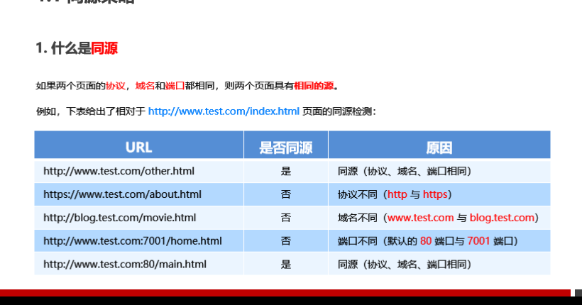
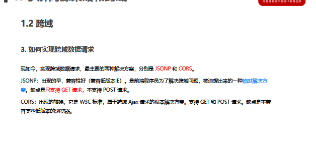
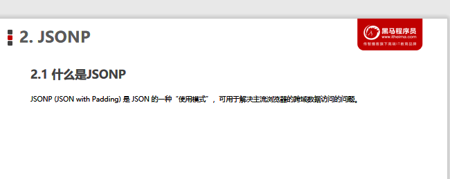
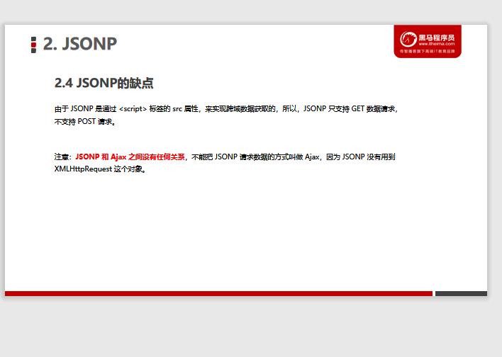
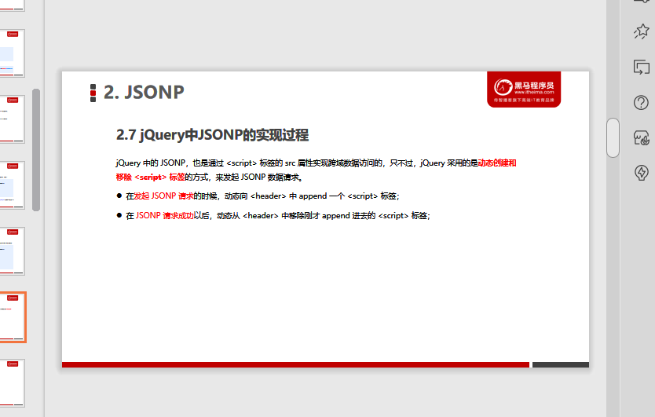
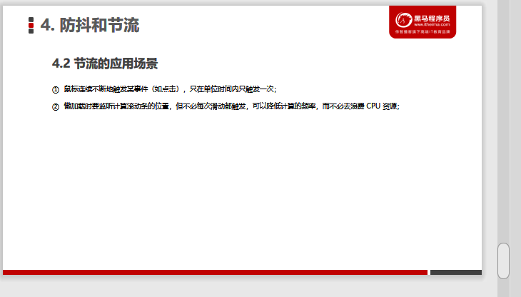

# [PPT04](D:\2022最新版黑马程序员前端学习路线图\2. 第二阶段 技术进阶\3.Ajax零基础入门\Ajax\Ajax—资料\day4\day4\ppt\03_跨域与JSONP.pptx)

# [案例--淘宝搜索](F:\4月web前端\2022黑马-web前端学习\7.Ajax和git( 涵盖了 Ajax、跨域、JSONP、模板引擎、节流防抖、XHR Level2 等常用技术)\2.案例\淘宝搜索案例\index.html)

# .......................................

# 了解同源策略

## 1.同源概念:

两个页面相同协议,域名和端口,则两页面有相同的源

[检测网址:]( http://www.test.com/index.html )

## 2.同源策略定义:

~~~html
浏览器提供的一种安全功能
MDN提供概念:
   .限制从一个源的文档或脚本加载另一个源的资源进行交互
~~~

## 3.跨域概念:

~~~html
不同源的两个URL交互
(跨域请求的数据无法获得响应)
~~~

### 1)如何实现跨域请求:JSONP和CORS

# ..............................................

# JSONP

## 1.定义:

解决跨域数据访问问题的使用模式

## 2.实现原理

~~~js
利用<script>标签,不受同源策略限制
~~~

## 3.缺点

### 只支持GET请求,不支持POST请求

## 4.jQuery中的JSONP

~~~js
$.ajax({
    url:'URL地址',
    dataType:'jsonp',
    success: function(res){
        console.log(res)
    }
})
//使用jQuery发送JSONP请求,会自动生成callback=jQueryxxx参数,随机参数
~~~

### \自定义参数及回调函数名称

~~~js
$.ajax({
    url:'URL地址',
    dataType:'jsonp',
    jsonp:'callback',
    jsonpCallback: '回调函数名',
    success: function(res){
        console.log(res)
    }
})
~~~

### \jQuery中JSONP实现过程

# ..........................................

# 防抖和节流

## 1.防抖debounce:

~~~html
当时间被触发后,延迟n秒后再触发,如果在n秒内事件又被触发,则重新计时
~~~

###  (1)应用场景

~~~js
输入框输入完成后,才执行请求,减少请求次数,节约请求资源
~~~

~~~js
 var timer = null                    // 1. 防抖动的 timer
 function debounceSearch(keywords) { // 2. 定义防抖的函数
    timer = setTimeout(function() {
    // 发起 JSONP 请求
    getSuggestList(keywords)
    }, 500)
 }

 $('#ipt').on('keyup', function() {  // 3. 在触发 keyup 事件时，立即清空 timer
    clearTimeout(timer)
    // ...省略其他代码
    debounceSearch(keywords)
 })
~~~

## 2.节流throttle:

~~~html
减少一段时间内事件的触发频率
~~~

### (1)应用场景

~~~js
$(function() {
  var angel = $('#angel')
  var timer = null // 1.预定义一个 timer 节流阀
  $(document).on('mousemove', function(e) {
    if (timer) { return } // 3.判断节流阀是否为空，如果不为空，则证明距离上次执行间隔不足16毫秒
    timer = setTimeout(function() {
      $(angel).css('left', e.pageX + 'px').css('top', e.pageY + 'px')
      timer = null // 2.当设置了鼠标跟随效果后，清空 timer 节流阀，方便下次开启延时器
    }, 16)
  })
})
~~~

## 3.防抖和节流的区别:

~~~js
防抖:事件被频繁触发,保证只有最后一次的触发才生效,前面的多次事件会被忽略;
节流:事件被频繁触发,减少事件触发的频率,有选择性的n秒内只执行一部分操作。
~~~

