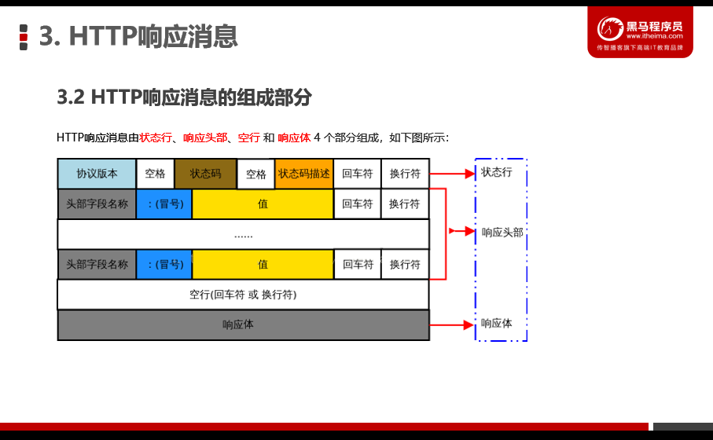

# [PPT05-HTTP协议](D:\2022最新版黑马程序员前端学习路线图\2. 第二阶段 技术进阶\3.Ajax零基础入门\Ajax\Ajax—资料\day5\day5\ppt\04_HTTP协议加强.pptx)

# .........................................

# HTTP协议简介

## 1.通信概念:

信息的传递和交换

- 主体

  客户端和服务器

- 内容

  信息

- 方式

  响应

## 2.通信协议

采用约定好的格式来发送信息和接受信息,约定好的格式,称作通信协议

## 3.HTTP协议:

# .....................................

# HTTP请求信息

## 1.概念:

~~~js
客户端发起的请求--HTTP请求
客户端发送到服务器的信息---HTTP请求信息或HTTP请求报文
~~~

## 2.组成部分(4部分):

1. 请求行request line

   ~~~js
   组成:
   请求方式,URL,http协议版本
   ~~~

   

2. 请求头部header

   [请求头部字段描述链接](https://developer.mozilla.org/zh-CN/docs/Web/HTTP/Headers)

   

   

3. 空行

   

4. 请求体

   

### 总结:

# ...................................

# HTTP响应信息

## 1.组成部分:状态行,响应头部,空行,响应体

### (1)状态行

### (2)响应头部

### (3)响应体

### (3)总结:

# ................................

# HTTP请求方法

# ................................

# HTTP响应状态码

## 1. HTTP响应状态码的组成及分类

