跟踪新文件:

~~~js
git status 文件名
~~~

提交文件到仓库中:

# 版本控制软件

~~~js
记录文件变化,便于查询版本修改情况的系统
~~~

~~~js
把原本手动管理的文件,改由软件管理文件的版本,这个负责文件管理的软件--版本控制软件
~~~

# 使用版本控制软件的好处

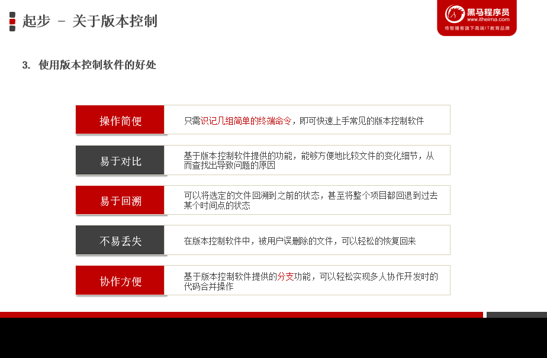

# 版本控制系统的分类

- 本地版本控制系统

  单机运行

- 集中化的版本控制系统(SVN)

  联网操作,支持多人协作开发;

  性能差,用户体验差

  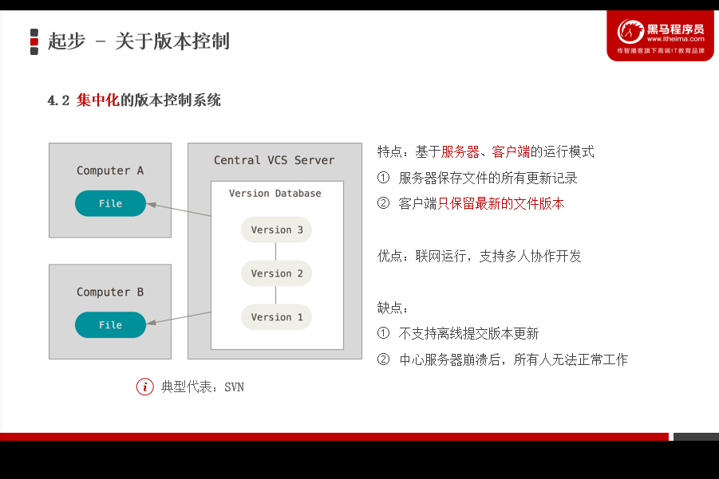

- 分布式版本控制系统(git)

  联网运行,支持多人协作开发,体验好

  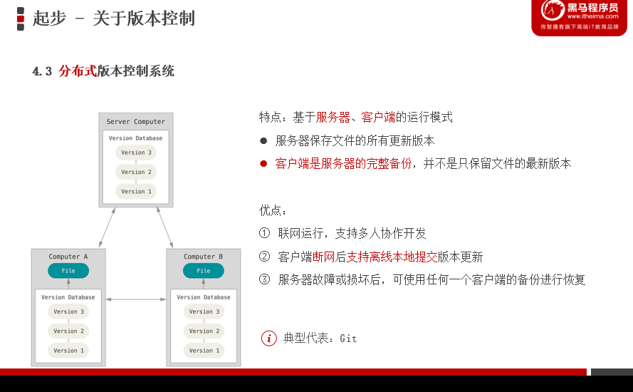

# ...............................

# Git基础

## 1.特性:

- 直接记录快照,而非差异比较
- 近乎所有操作都是本地执行

## 2.与SVN差异比较

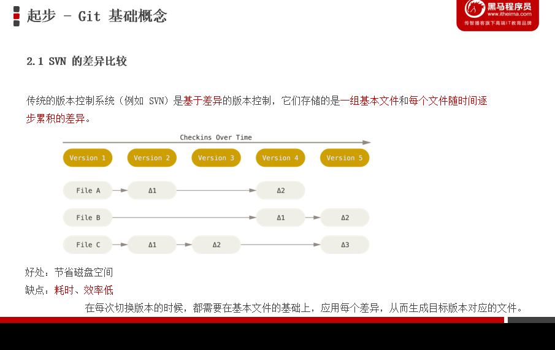

## 3.Git的记录快照

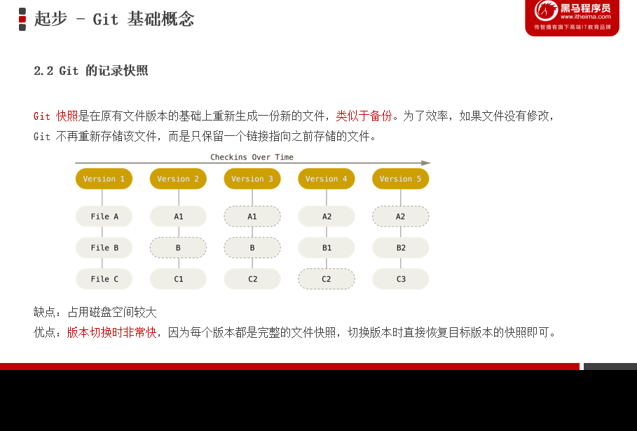

## 4.Git操作几乎都是本地执行

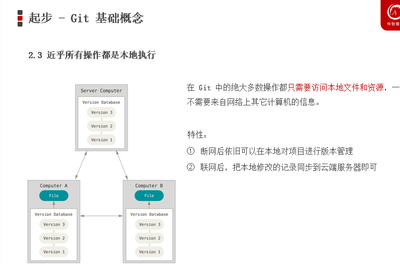

## 5.Git的三个区域

## 工作区,暂存区,Git仓库

~~~js
工作区--处理工作;
暂存区--已完成工作的临时存放区域,等待被提交;
仓库--最终存放
~~~

## ==6.Git中的三种状态:==

### 1.已修改modified

~~~js
已修改文件,但是没将修改后的结果放到暂存区
~~~

### 2.已暂存staged

~~~js
表示对已修改文件做了当前版本标记,使之包含在下次提交的列表中(已修改文件并放入暂存区)
~~~

### 3.已提交committed

~~~js
表示文件保存在本地Git仓库中(保持特定版本的文件)
~~~

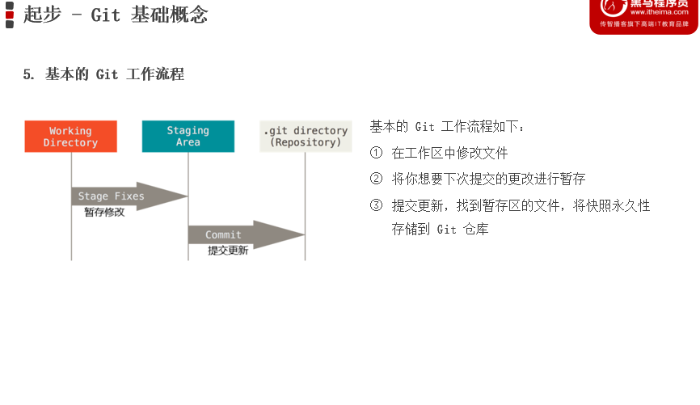

# ...............................

# Git配置用户信息

~~~git
git config --global user.name "用户名"
git config --global user.email "邮箱地址"
~~~

## 1.全局配置文件.gitconfig

配置一次,永久生效

## 2.Git中检查配置信息的命令

~~~git
#查看所有配置信息
git config --list --global
#查看制定配置信息-用户名和用户邮箱
git config user.name 
git config user.email
~~~

## 3.获取帮助信息

~~~git
# 打开git cofig 帮助命令的手册
git help config
#获取快速参考手册
git config -h
~~~

## 4.现有目录中初始化仓库--创建一个git仓库

~~~git
# 鼠标右键目录文件夹,打开Git Bash,当前目录转化为Git仓库
git init
~~~

- 自动创建一个.git隐藏目录(git仓库)

# ....................................

# Git的基本操作

## 1.工作区的四种状态

1. |      未被Git管理      |                       已被Git管理                       |
   | :-------------------: | :-----------------------------------------------------: |
   | 未跟踪的文件Untracked | 未修改Unmodified与Git仓库保存的文件保持一致(我们的目的) |
   |                       |             已修改Modified,与Git保存不一致              |
   |                       |    已暂存Staged,放到暂存区,准备将其提交保存到Git仓库    |

## 2.检查文件状态status

~~~git
#输出文件状态详细
git status
# 精简方式展现文件状态
git status -s
~~~

## <u>***3.提交更新:add>commit>未修改Unmodified***</u>

| 1.状态 | 显示标记 |        2.输入指令        |        升级后状态        | 3.输入指令                                 | 升级后状态       |
| -----: | :------- | :----------------------: | :----------------------: | ------------------------------------------ | ---------------- |
| 未跟踪 | ??       | git add 文件名--文件跟踪 | 暂存状态 A(绿色A)-暂存区 | git commit -m "本次提交信息(描述提交内容)" | 未修改状态(目的) |

## <u>***4.对已提交文件进行修改(M)Modified***</u>

当目前文件已被跟踪并已经提交到仓库中,工作区文件与仓库中保存文件保持一致.这时修改文件,再输入文件状态指令status显示文件状态(M)Modified--已修改状态

|               文件 | 指令后                       |         显示status          |
| -----------------: | :--------------------------- | :-------------------------: |
|           1.已修改 | 修改文件内容后               | M(红色)--未放到暂存区staged |
| 2.修改且未在暂存区 | git add 文件名               | M(绿色)--已修改文件在暂存区 |
|  3.提交已暂存(绿M) | git commit -m "提交文件描述" |      nothing to commit      |

## 5.向暂存区一次性提交多个文件add .

~~~git
# 暂存区添加多个文件:提交所有新增和修改的文件
git add .
~~~

## 6.取消文件暂存 reset HEAD

~~~git
# 从暂存区移除文件
git reset HEAD 移除文件名
~~~

## 7.跳过暂存区直接到Git仓库

~~~git
# Git就会自动把所有已经跟踪过的文件暂存起来一并提交，从而跳过 git add 
git commit -a -m "提交信息描述"
~~~

## 8.移除文件rm

|    从Git仓库和工作区移除文件     | git rm -f 文件名       |
| :------------------------------: | ---------------------- |
| 从Git仓库移除文件,保留工作区问价 | git rm --cached 文件名 |

## <u>**9.忽略文件.gitignore**</u>

| 格式:    | 解析:            |
| -------- | ---------------- |
| # 开头   | 注释             |
| / 结尾   | 是目录           |
| / 开头   | 防止递归         |
| ! 开头   | 取反             |
| glob模式 | 匹配文件与文件夹 |

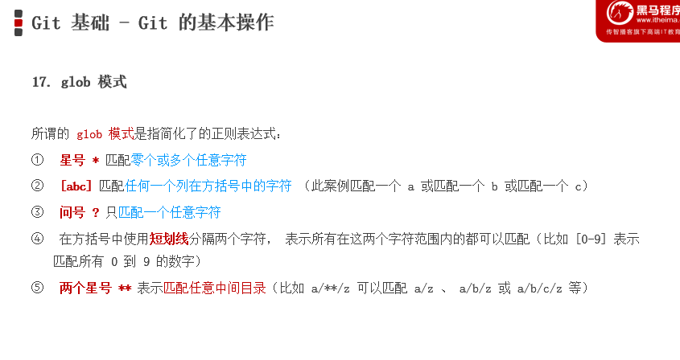

## 01.查看提交历史

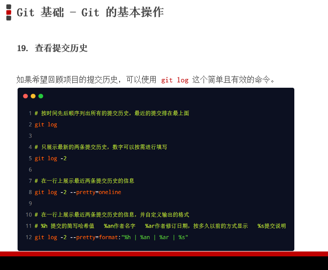

## 02回退到指定版本

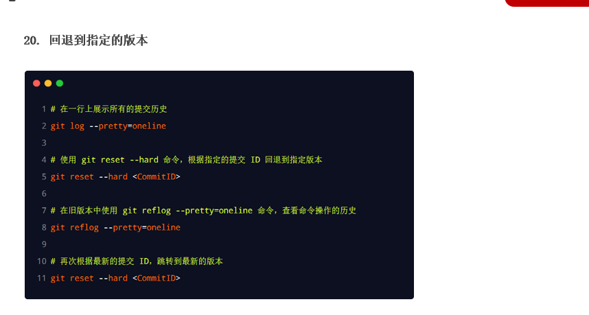

# .....................................

# Github开源

## 1.什么是开源

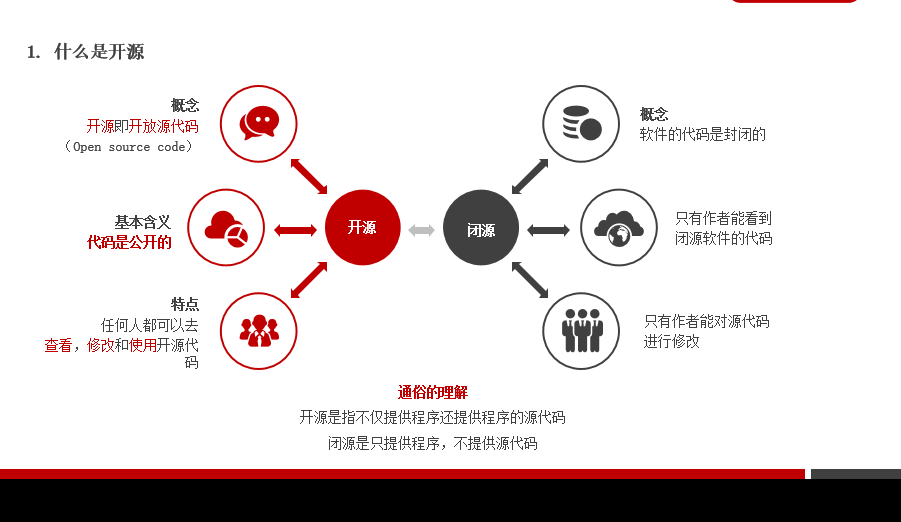

## 2.常见的开源许可协议GPL,MIT......

###### [开源许可协议网址:](https://www.runoob.com/w3cnote/open-source-license.html)

## 3.开源项目托管平台GitHub...

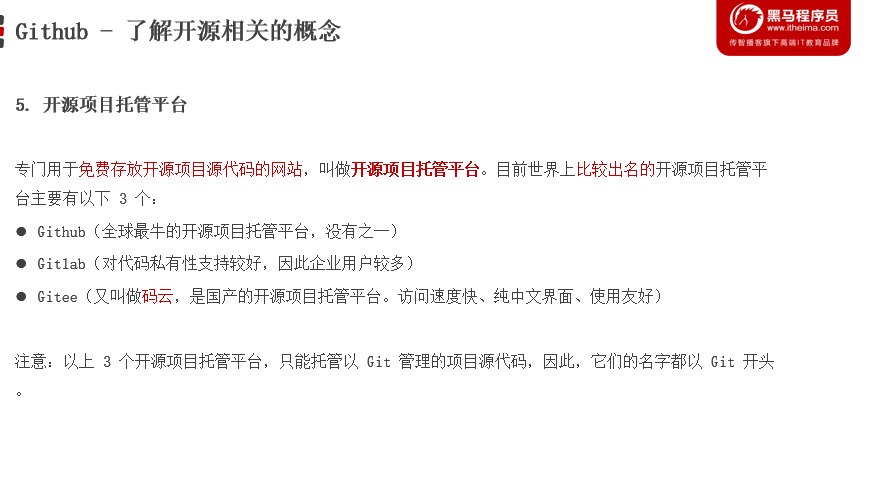

### 1.基于HTTPS将本地仓库上传到Github

零配置；但是每次访问仓库时，需要重复输入 Github 的账号和密码才能访问成功

### ==2.SSH访问方式==

需要进行额外的配置；但是配置成功后，每次访问仓库时，不需重复输入 Github 的账号和密码

#### 1)SSH key

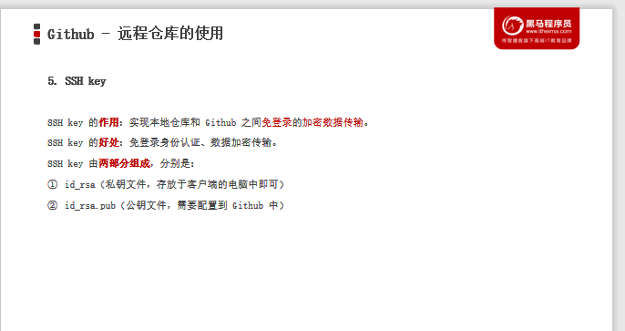

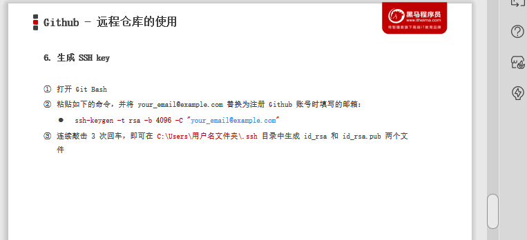

配置SSH key:

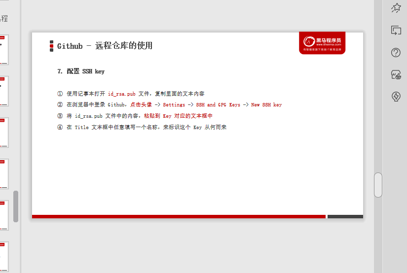

# ...................................................

# ==将远程仓库克隆到本地==

~~~git
git clone 远程仓库的地址
~~~

# ..............................................

# Git分支

## 1.本地分支操作

### 1)分支作用--协同开发互不干扰:

~~~js
在进行多人协作开发的时候，为了防止互相干扰，提高协同开发的体验，建议每个开发者都基于分支进行项目功能的开发
~~~

### 2)master/main 主分支

本地仓库初始化默认创建主分支-master

~~~js
主分支作用:
用来保存和记录整个项目已完成的功能代码
~~~

功能分支:

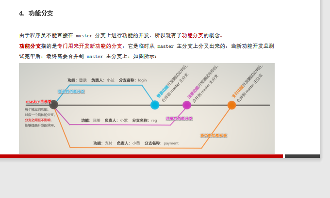

### 3)查看分支branch

~~~git
git branch
#运行结果
各分支包括主分支
# *在分支上,表示当前所处的分支
~~~

### 4)创建新分支

~~~git
git branch 新分支名
~~~

### 5)切换分支checkout

~~~git
git checkout 分支名
~~~

### 6)分支创建和快速切换一体化

~~~git
# 创建新分支和切换到新分支,一步到位
git checkout -b 新分支名 
~~~

### 7)合并分支merge

- 先切换到主分支上master/main

- 再执行代码:

  ~~~git
  git merge 分支名
  ~~~

### 8)删除分支-b

~~~git
git branch -b 分支名
~~~

### 9)遇到分支合并时发生冲突--<u>*手动修改*</u>

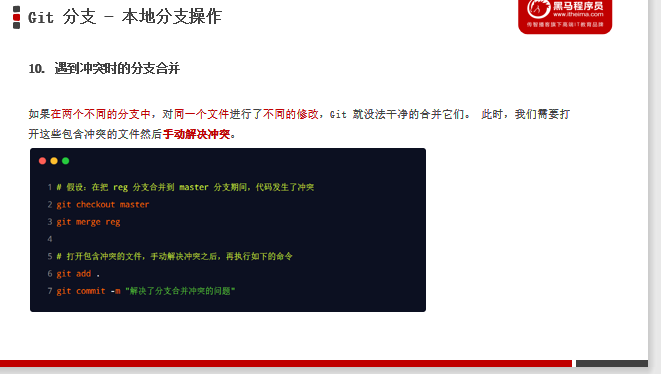

# .............................................

## 2.远程分支操作push

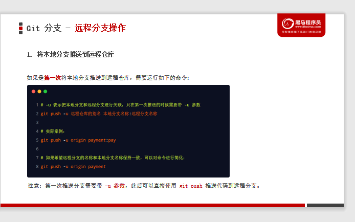

~~~git
# 本地仓库同步远程仓库,之前同步了远程仓库,现在只需要
git push
~~~

### 1)查看远程仓库中所有的分支列表 show

~~~git
git remote show 远程仓库名称
~~~

### 2)跟踪分支

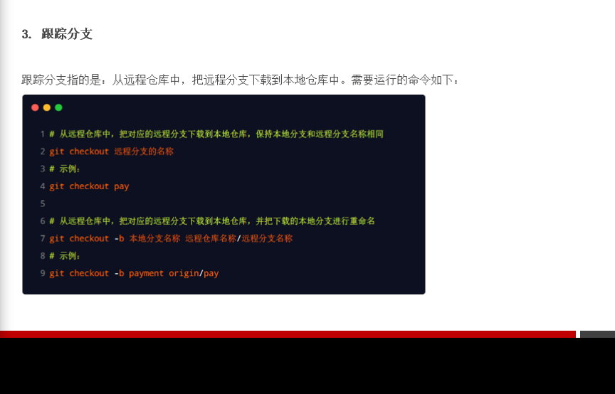

### 3)拉去远程分支的最新代码pull

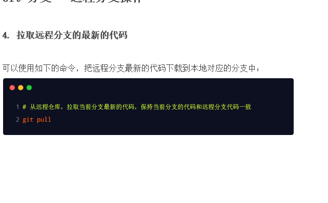

### 4)删除远程分支--delete

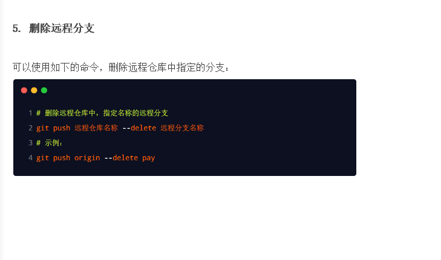

